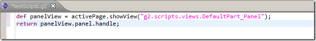

## Opening up a native Chrome Browser window inside Eclipse (raw version)

On the [Win32 Window's Hijack theme](http://blog.diniscruz.com/search/label/WinAPI), here is a raw version of how to show an actual Chrome browser window inside an Eclipse view (ie. a window from a C++ process inside a JVM-based Process).

Using the Groovy execution capabilities described in the [Programming Eclipse in Real-Time (using an 'Groovy based' Eclipse Plug-in)](http://blog.diniscruz.com/2013/08/programming-eclipse-in-real-time-using.html) post, in Eclipse, I start by creating an instance of a SWT panel and get its handle:  

After executing that script we will get an empty panel in the bottom of the screen:

... and the **_4461984_** return value in the purple 'Groovy script output window'

... which is the handle to that Panel/View (which is where were we are going to insert our hijacked window).

In an [C# REPL UI](http://blog.diniscruz.com/p/c-repl-script-environment.html), we can now use this script (that consumes that **_4461984_** handle) to open an Cmd.exe and hijack its window into the Eclipse panel:

... which looks like this:

... in eclipse:

Since what we want is chrome, we can use the **_API_Chrome_Hijack_** API to:  

  1. open up a new instance of chrome,
  2. find its dedicated process and
  3. get that process MainWindowHandle

... which looks like this:

Finally here is the script that starts a new instance of chrome and insert's it into the eclipse panel:

... which looks like this (in Eclipse)

Note the native Chrome window (C++ Process)  fitting nicely with the Eclipse UI (JVM Process)

Since chrome is now running inside an native Eclipse view/control, we can put it where ever we want tit to be (inside the Eclipse UI).

Like on the top right:

... on the left:

... maximised

... as a detached eclipse window:

..or in the middle (with another chrome tab opened inside the same Hijacked panel)

Here is the Groovy script that created the panel (in Eclipse)

{lang="csharp"}
    def panelView = activePage.showView("g2.scripts.views.DefaultPart_Panel");  
    return panelView.panel.handle;

Here is the C# Script that did the Handle setParent:

{lang="csharp"}
    var chromeHijack = new API_Chrome_Hijack().open_ChromeDriver();  
    var chromeHandle = chromeHijack.ChromeProcess.MainWindowHandle;

    var eclipsePanel = 4461984.intPtr();

    chromeHandle.setParent(eclipsePanel);

    500.sleep();

    chromeHandle.window_Maximized();

    //O2File:API_Chrome_Hijack.cs  
    //O2File:API_WinAPI.cs  
    //using O2.XRules.Database.APIs  
