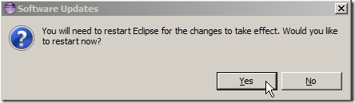
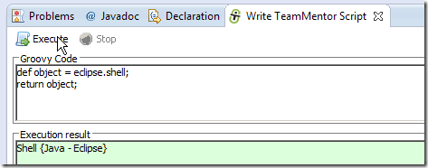
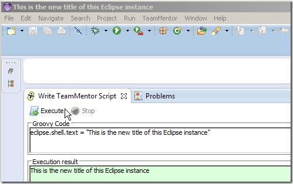
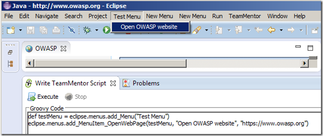

## Installing Eclipse Plugin Builder, accessing Eclipse objects and adding a new Menu Item that opens Owasp.org website

This post shows how to use the Eclipse Plugin Update site described in [TeamMentor Plugin and Builder v1.5.6 (Source Code and Eclipse Update site)](http://blog.diniscruz.com/2013/11/teammentor-plugin-and-builder-v156.html) to install and use the Eclipse Builder Kit that we open sourced last week.

The objective is to do these actions, without needing to start Eclipse to see them:

  * Dynamically access eclipse objects like: Shell, Workbench, Worksapce, ActiveWorkbenchPage, Display, etc...
  * Open the [http://www.owasp.org](http://www.owasp.org/) website in a browser (and put it inside an Action object)
  * Add new Menu called 'OWASP'
  * Add a menu Item to the 'OWASP' menu called 'Open OWASP website' that calls the Action object that opens wht OWASP website.

**Step 1:_ _Install the TeamMentor Plugin version 1.5.6 in Kepler**  

In a default install of Kepler (this should also work in versions 3.7 (Indigo) and 4.2 (Juno))

...open the **_Install New Software..._** menu option:

...enter the value [http://eclipse-plugin-builder.azurewebsites.net](http://eclipse-plugin-builder.azurewebsites.net/) the **_Work with:_** Textbox

...select the **_TeamMentor Eclipse PlugIn -- For Fortify_** option and click Next

... click **_Next_**:

... accept the terms and click **_Finish_**:

... click OK on the unsigned warning (this will be addressed on the final build)

... and finally click **_Yes_** to reboot:

**Step 2: Enable script support and write a 'Hello World' script**  

Once Eclipse starts, you should see a **_TeamMentor_** menu, where you need to click on the **_Open Properties Page_** menu item

... select the **_Show Advanced Mode Features_** checkbox:

... click **_OK_**  

... and open the **_Util -- Write Script (TeamMentor DSL)_** menu item from the (new) **_Advanced and Debug Features_** menu

NOTE: if you are running this on Indigo, you will need to restart Eclipse since menu visibility is not loaded dynamically (as it is in Kepler). I'm sure there is a way to force its refresh, so if you know about it, let me know.

The scripting UI should look like this:

... where if you click on **_Execute_** you should see of one of TeamMentor's article showing up in a browser window

... and an eclipse object string representation (in this case **_tm.eclipse.api.EclipseAPI@1ffbe29_**) in the script UI's **_Execution result_** panel

To create the first **_Hello World_** example, replace the text inside the  **_Groovy Code_** panel with:

... and click on **_Execute_** to see the **_Hello World_** in the **_Execution result_** panel

Note that the **Execution result** will show the last object of the Groovy script execution, so you can just do this:

**Step 3: Access Internal Eclipse objects to view/change properties values and invoke methods**  

What is really powerful about this scripting environment, is the fact that it is running on the Eclipse JVM, which means that it has access to all Eclipse objects in real time.

In practice, this means that we can access Eclipse objects and manipulate them right inside the Eclipse instance we are running the scripts! No more waiting 30s to see the effect of a code change or simple code test :)

To make life/coding easier, most of the common objects one needs when programming eclipse are exposed via the [EclipseApi class](https://github.com/TeamMentor/TeamMentor_Eclipse_Plugin/blob/develop/TeamMentor.Eclipse.PlugIn.Fortify/src/tm/eclipse/api/EclipseAPI.java), which is available via the **_eclipse_** object (or the **_eclipseAPI_** object) already mapped to the current Groovy script being executed:

Groovy has a nice Object Viewer helper UI in the _**groovy.inspect.swingui.ObjectBrowser**_ class, which is exposed as the **_inspect({any object})_** method that can be used (see below) to view all **_Public Fields and Properties_** of the eclipse object:

and all **_(Meta) Methods:_**  

Here is a quick view of the main helper fields mapped to Eclipse objects:

**eclipse.shell**  

.... which is an instance of _**org.eclipse.swt.widgets.Shell**_:

**_eclipse.workbench_** (instance of **_org.eclipse.ui.internal.Workbench_**)

**_eclipse.workspace_** (instance of **_org.eclipse.ui.internal.resources.Workspace_**)

**_eclipse.activeWorkbenchPage_** (instance of **_org.eclipse.ui.internal.WorkbenchPage_**)

**_eclipse.activeWorkbenchWindow_** (instance of **_org.eclipse.ui.internal.WorkbenchWindow_**)

**_eclipse.display_** (instance of **_org.eclipse.swt.widgets.Display_**)

The reason why is very powerful to have access to these objects is that have real-time read/write access to its properties/fields

For example use **_inspect(eclipse.shell)_** to see the current Eclipse's Shell object properties/fields:

note: since we are using Groovy we can also use: **_eclipse.shell.dump()_**  

If you look at the list of the properties/fields in the **_eclipse.shell_** object, notice that there is one called **_text_**,which is the value of the current Shell window title (in the case below 'Java -- Eclipse')

Not only we have access to this value, we can be dynamically change it:

We can also easily open views like this:

.. or get a list of open views:

**Step 4: Add a new Menu Item that opens OWASP.org website**  

Now, lets say that we want to so something more interesting like adding a new Menu Item that opened the [http://www.owasp.org](http://www.owasp.org/) website.

We can start with this code snippet that will open the Eclipse internal browser:  

{lang="csharp"}    
    def browserId = "Test Browser";  
    def website= "http://www.owasp.org";  
    def browser = eclipse.workbench.getBrowserSupport().createBrowser(browserId);  
    browser.openURL(new URL(website));

... which when executed will look like this:

Next lets move the code that opens a browser into an Action object:

{lang="csharp"}    
    import org.eclipse.jface.action.Action;  
    def final _eclipse = eclipse;  
    Action action = new Action()  {  
                                     @Override  
                                     public void run() {                              
                                                          def browserId = "Test Browser";  
                                                          def website= "https://www.google.com"; //"http://www.owasp.org";    
                                                          def browser = _eclipse.workbench.getBrowserSupport().createBrowser(browserId);  
                                                          browser.openURL(new URL(website));  
                                                       }  
                                 }

    return action.run();  

Here is the code that will create a new Menu (not visible until it has an action)

{lang="csharp"}    
    def menuName = "New Menu";  
    def topMenuManager      = eclipse.activeWorkbenchWindow.getMenuManager()  
    MenuManager newMenu = new MenuManager(menuName);  
    topMenuManager.prependToGroup(IWorkbenchActionConstants.MB_ADDITIONS, newMenu);

Putting the two together:

{lang="csharp"}
    import org.eclipse.jface.action.*;  
    import org.eclipse.ui.IWorkbenchActionConstants;

    def final _eclipse = eclipse;

    def menuName = "New Menu";  
    def actionName = "open owasp.org";  
    def topMenuManager = eclipse.activeWorkbenchWindow.getMenuManager()  
    MenuManager newMenu = new MenuManager(menuName);  
    topMenuManager.prependToGroup(IWorkbenchActionConstants.MB_ADDITIONS, newMenu);

    Action action = new Action(actionName) {  
      @Override   
      public void run() {   
        def browserId = "Test Browser";  
        def website= "http://www.owasp.org";  
        def browser = _eclipse.workbench.getBrowserSupport().createBrowser(browserId);  
        browser.openURL(new URL(website));  
      }  
    }

    newMenu.add(action)

    topMenuManager.update(true);

    return topMenuManager;  

We get a new menu:

...which when selected will open an browser with [https://www.owasp.org](https://www.owasp.org/)

What is really interesting in the code sample above, is how close we are to programming in pure java in normal Eclipse plugin development mode (great when learning how the API works and following the existing code sample).

But since my view in API development is to make it as easy as possible to perform the desired action, I added an helper method to the EClipseAPI to create a menu item that opens a browser window

Using the helper API, the entire code above can be replaced with:  

{lang="csharp"}
    def testMenu = eclipse.menus.add_Menu("Test Menu")  
    eclipse.menus.add_MenuItem_OpenWebPage(testMenu, "Open OWASP website", [https://www.owasp.org](https://www.owasp.org/))

...which when executed will add the **_Test Menu_** to the top menu with a **_Open OWASP website_** menu item

Note1 : In C# I could had made that API even simpler since I could had used Extension methods to add the **_add_Menu_Item_** method to the **_MenuManager_** class

Note 2: There are a couple more helper methods which you can see at: [https://github.com/TeamMentor/TeamMentor_Eclipse_Plugin/blob/develop/TeamMentor.Eclipse.PlugIn.Fortify/src/tm/eclipse/api/Menus.java](https://github.com/TeamMentor/TeamMentor_Eclipse_Plugin/blob/develop/TeamMentor.Eclipse.PlugIn.Fortify/src/tm/eclipse/api/Menus.java)  

**Appendix: Auto updates**

Once you can have the Plug-in installed, you can get updates via the 'Check for Updates' menu option (note that moment fixes are pushed as minor updates, so you might not get the latest version after the first install):

If there is an update, you will get a window that looks like this:

... where you can review the updates and click ''Next'

... access the license and click Finish

... click OK (if you are not in an hostile network that is able to dynamically backdoor Eclipse plugins on the fly):

... and finally click **YES** to reboot:

Note: if you want the checks to happen automatically, you can set it here:

