## Installing, compiling and failing to use DCE VM for Eclipse Plugin development

Last night I tried to use the amazing [DCE VM](http://ssw.jku.at/dcevm/) tool (DCE = Dynamic Code Evolution) to apply hot fixes to the APIs I was creating for the open source [Eclipse API Tool Kit I'm working](http://blog.diniscruz.com/2013/11/si-open-sources-eclipse-plugin.html) on (as part of the [TeamMentor Eclipse](http://blog.diniscruz.com/2013/11/teammentor-plugin-and-builder-v156.html) [Fortify Plugin](http://blog.diniscruz.com/2013/09/two-videos-showing-teammentor-eclipse.html)).

I was trying to address the limitations of the JVM's HotSwap technology which only works on certain inline code changes, and doesn't support at all the addition and changing of new methods.

TLDR: this post **doesn't have the solution for this problem** (see next post which shows JRebel in action).

In this post I'm going to show the workflow/steps that I followed to:

  * create a version of DCE VM that worked on OSX Mavericks (after failing to use the provided binaries, and needing to compile the DCE VM code),  
  * run eclipse under the modified/patched JDK
  * get a 'hang' in Eclipse when one of the dynamic code changes was applied.

**Part 1: Trying to install the binaries**  

The first step was to go to the [DCE VM](http://ssw.jku.at/dcevm/) website:  

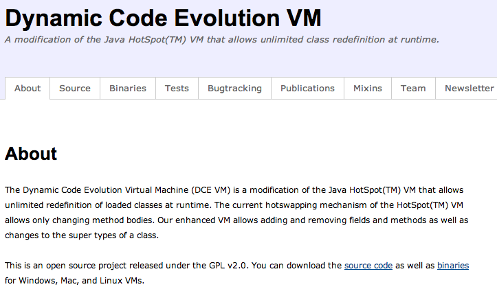

Open the [Binaries](http://ssw.jku.at/dcevm/binaries/) page, download the osx version of [dcevm-0.2-mac.jar](http://ssw.jku.at/dcevm/downloads/dcevm-0.2-mac.jar) and execute it locally:

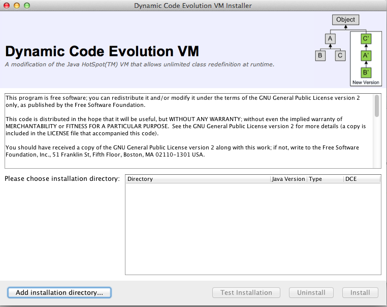

Unfortunately there were no VMs picked up by default.

So I tried to the the default OSx Java install dir,  which was here:

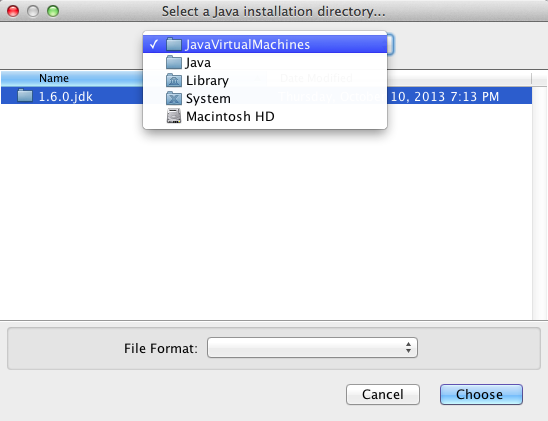

But that didn't work:

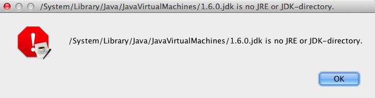

So I downloaded from Oracle the latest version of the OSX JDK to this dev laptop:

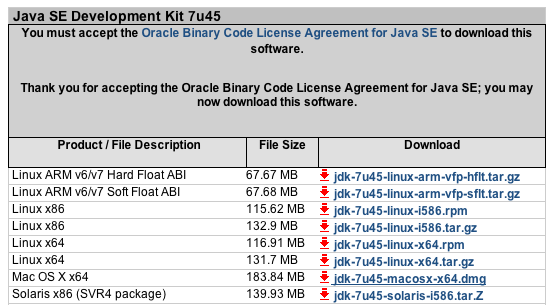

... which was placed here:

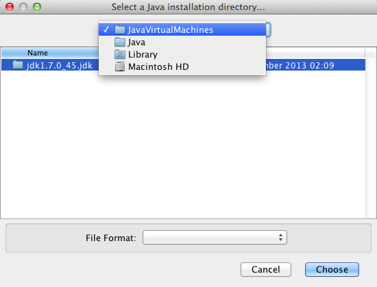

But that folder didn't work either

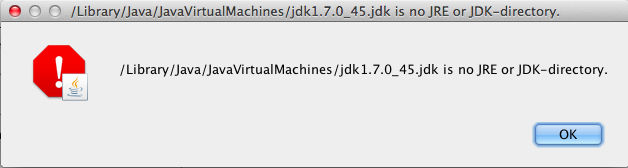

So didn't this one:

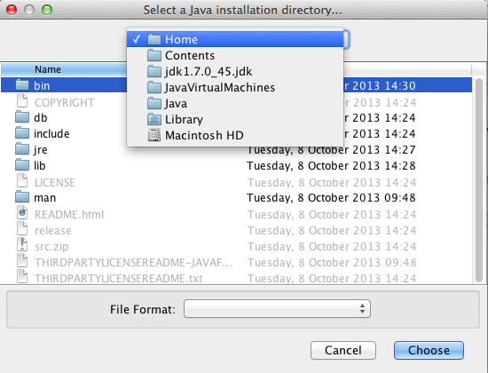

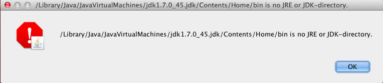

But this did:

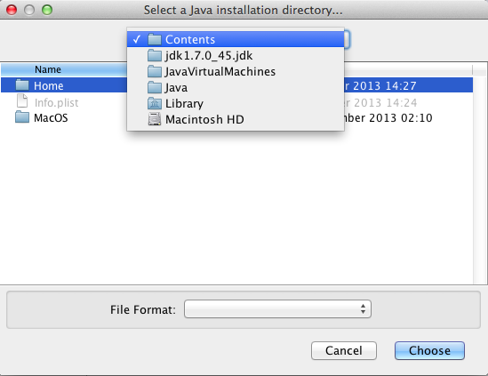

Well, it was originally recognized as a JDK, but when I clicked on **_Install_**

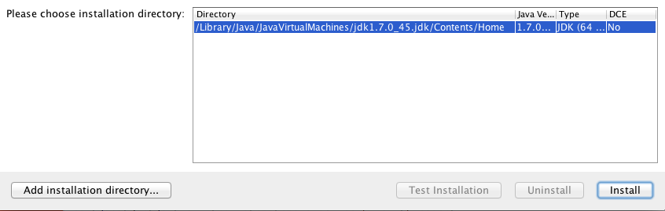

I got this error:

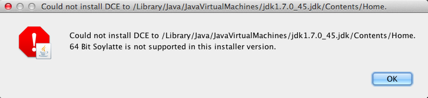

**Part 2: Building DCE VM from Source**

Since the binaries option didn't work, it was time for plan B, which was to use the latest version of the code (from GitHub) and build it.

The best instructions I found came from this blog entry from Sogety: [TRUE HOT SWAP IN JAVA WITH DCEVM ON OS-X](http://java.sogeti.nl/JavaBlog/2013/12/09/true-hot-swap-in-java-with-dcevm-on-os-x/) :

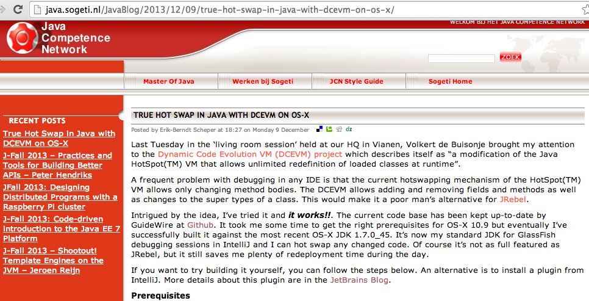

... which took me though the following steps (you can copy and paste the [instructions from that blog post](http://java.sogeti.nl/JavaBlog/2013/12/09/true-hot-swap-in-java-with-dcevm-on-os-x/))

After [installing Gradle](http://blog.diniscruz.com/2013/12/installing-gradle-on-osx.html) and the OSX dev tools, I cloned the [https://github.com/Guidewire/DCEVM](https://github.com/Guidewire/DCEVM) repo and switched into the **_full-jdk7u45_** branch

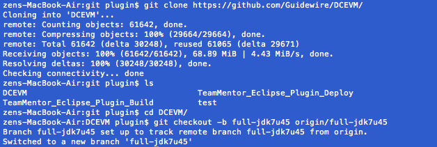

Then I executed **_gradle_**

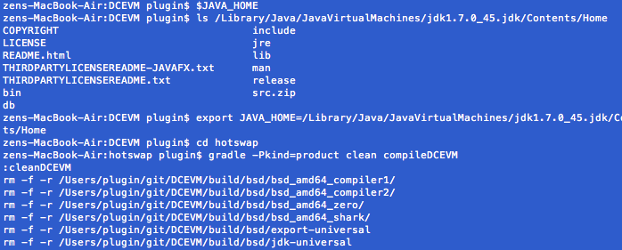

.... which took a while (with tons and tons of warning messages)

... and eventually:

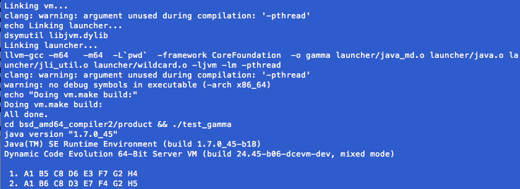

... the compilation completed:

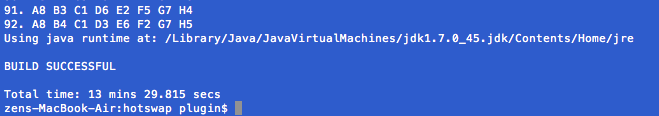

... the final step was to create a copy of the **_jdk1.7.0_45.jdk _** folder and copy the created \*.dylib files into the new _jdk1.7.0_45_dcevm.jdk/Contents/Home/jre/lib/server_ folder:

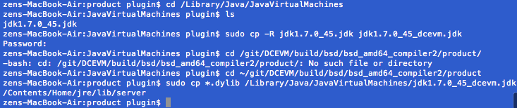

Finally I was able to try it, and I got this error (while executing _java --version_ (as mentioned on the [blog post](http://java.sogeti.nl/JavaBlog/2013/12/09/true-hot-swap-in-java-with-dcevm-on-os-x/))

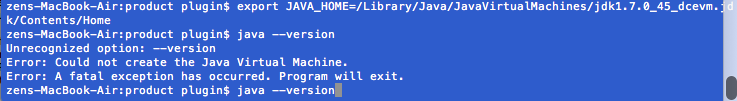

... which was caused by the fact that the comment that works is **_java -version_** :)

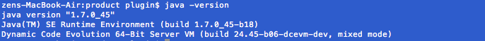

So as you can see from the screenshot above, we now have a patched JVM with Dynamic Code Evolution enabled :)

**Step 3) trying to use the patch JVM to run the TeamMentor Eclipse Plugin**  

Since there are a number of blog posts out there that show that once you have the patched JVM it should work (see  [Dynamic Code Evolution for Java](http://jaxenter.com/dynamic-code-evolution-for-java-37373.html), [Redeploy alternatives to JRebel](http://stackoverflow.com/questions/7998669/redeploy-alternatives-to-jrebel) and  [Get True Hot Swap in Java with DCEVM and IntelliJ IDEA](http://blog.jetbrains.com/idea/2013/07/get-true-hot-swap-in-java-with-dcevm-and-intellij-idea/) ), it was time to see it in action :)

I opened up the Eclipse which has the dev version of the plugin, went into the **_Run Configurations_** page, and created a duplicate of my main **_Eclipse Application_** configuration:

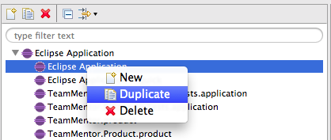

Then, on the**_ Java Runtime Environment_** section,  I clicked on the **_Environments_** button:

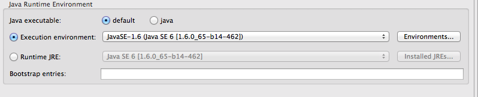

Where I had to add the patched 1.7 JDK by clicking on **_Add..._**

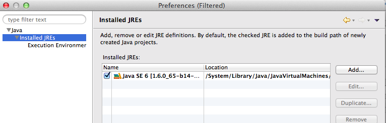

Then choosing **_Standard VM_** on **_Add JRE_** popup window:

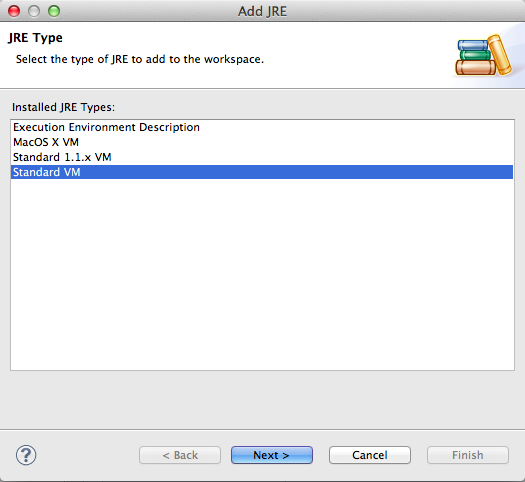

... selected this folder (note the**_ jdk1.7.0_45_dcevm.jdk_** in the path)

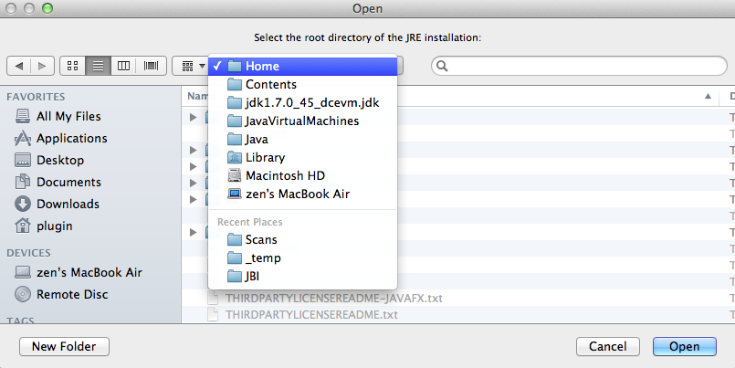

... gave it a relevant name (in this case **_JDK 1.7 - DCE VM_**), and clicked clicked on **Finish**:

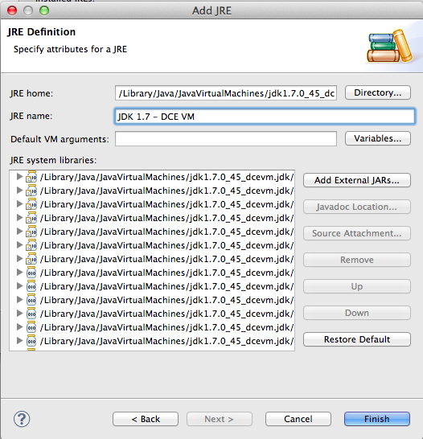

Next I selected the newly created JDK mapping from the **_Execution Environment_** drop-down:

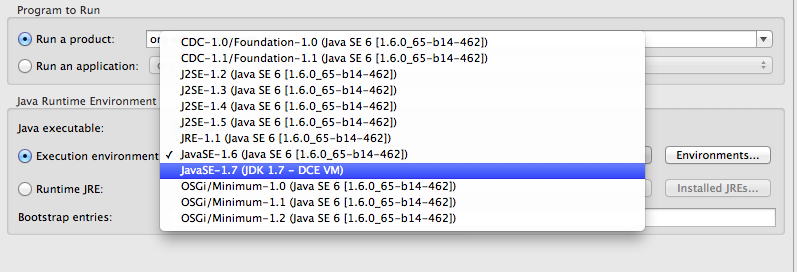

And clicked on **Run**

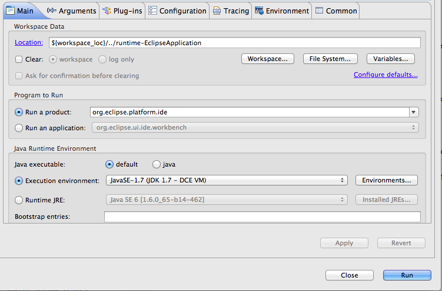

The console window gives us a confirmation that we are running from the **jdk1.7.0_45_dcevm.jdk** path (see first line in screenshot below)

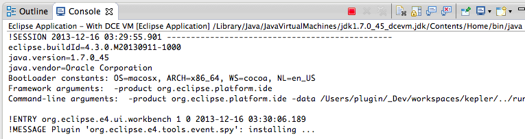

And so do the **_ Installation Details_** from the newly started Eclipse instance:

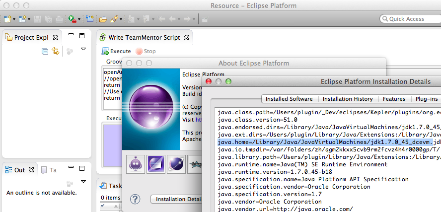

Next is was time to make some live changes, for example a) on a preferences page description (see top editor) or b) adding a new static field (see bottom editor):

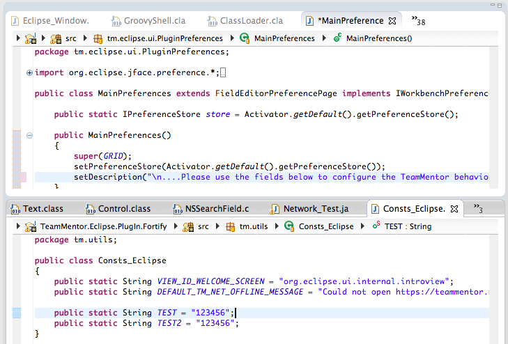

And although it didn't work when I had it running under **Run** (which was expected), when I restarted eclipse under **Debug** , it hang as soon as I:

1) executed a script that loaded one of the classes I wanted to changed (i.e the target class was loaded into the JVM)  
2) made a change in the host eclipse and saved it (which triggered the compilation of that file and the creation of a new version of the target class)  
3) went back to the 'under debug' version of eclipse (which by now hanged with a OSX [Spinning_pinwheel](http://en.wikipedia.org/wiki/Spinning_pinwheel) )

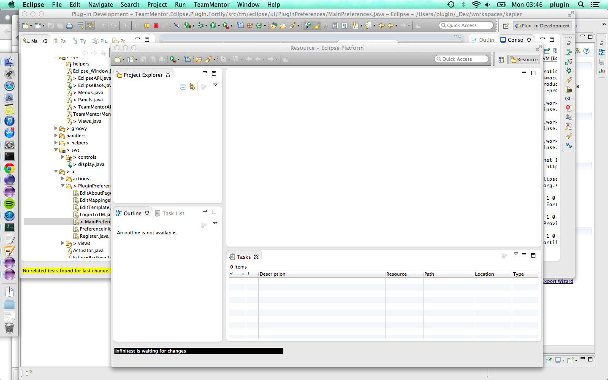

Which was a bummer since I was really looking forward to using the DCE VM technology.

Note that I also tried running the host Eclipse under the DCE VM, which gave me the same result (that said, on the positive side, I had both Eclipses running under the patched JDK which is quite cool)

The solution was to try [JRebel](http://zeroturnaround.com/software/jrebel/) which worked (see my next post)
