## Using JRebel to HotSwap new Static String fields in an Eclipse Plugin (without Eclipse restart)

After [Installing, compiling and failing to use DCE VM for Eclipse Plugin development](http://blog.diniscruz.com/2013/12/installing-compiling-and-failing-to-use.html) it was time to give [JRebel](http://zeroturnaround.com/software/jrebel/) a go (which is a commercial plugin that costs about ~300 USD per year).

TLDR: It worked and I was able to run an Eclipse Plugin, make big changes in a class already loaded (like adding a new field/method), and have access to those changes without needing to restart Eclipse.

**Part 1: Installing JRebel**

First step was to install JRebel from the Eclipse Marketplace:

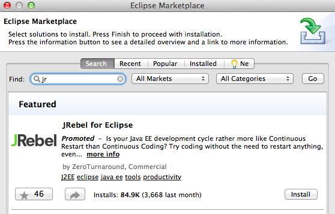

 ... with these features:

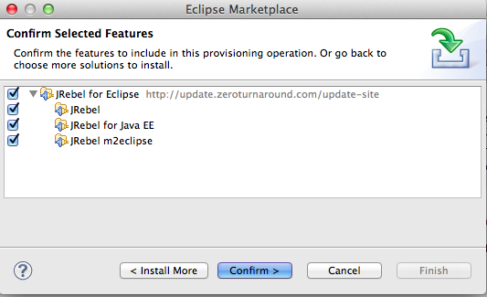

... which took a little bit to install since there were a number of large downloads:

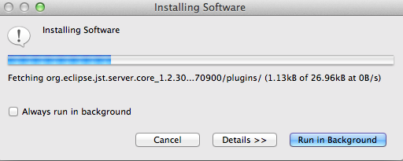

After the installation (and Eclipse restart) we get an alert message that looks like this:

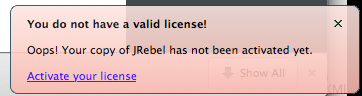

Clicking on the **_Active your license_** takes us to this screen:

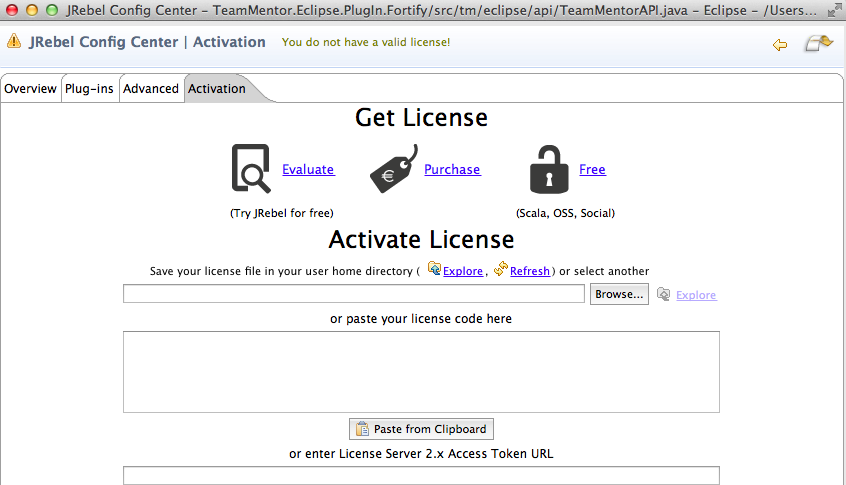

Clicking on the **_Evaluate_** takes us to the JRebel website where we can request a license:

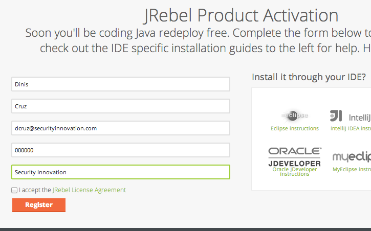

 ... which is sent immediately (thx [Zero Turnaround](http://zeroturnaround.com/)):

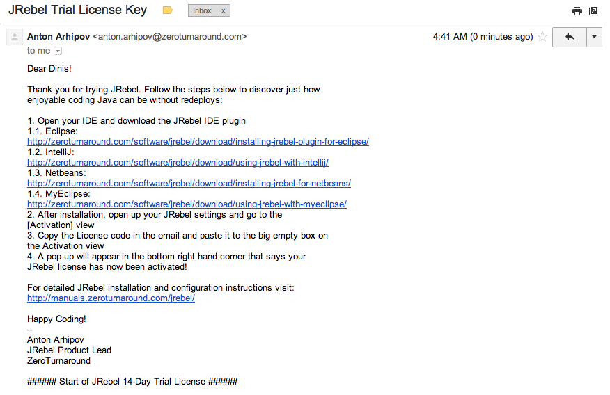

To activate it, I copied and paste the license string (without the pre and post comments) into the provided TextBox , and we get a little visual clue (top left icon goes green) that the license is good:

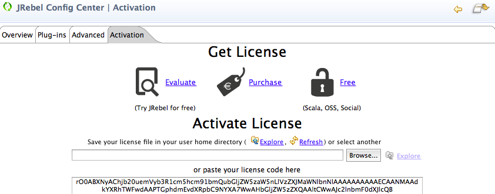

**Part 2: Configure JRebel**  

To add JRebel to the Plugin project, there were two things to do:

1) add the JRebel Nature:

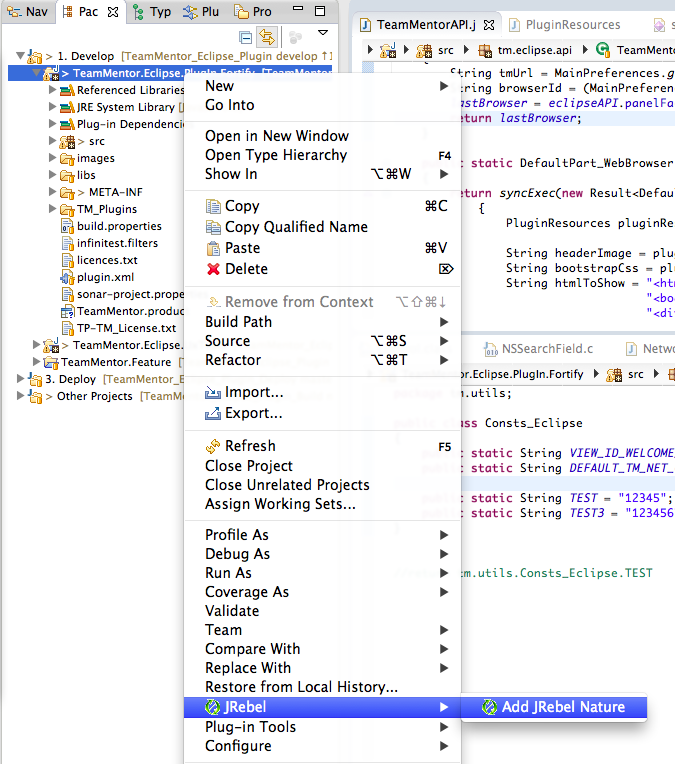

2) enable JRebel in the desired Run Configuration:

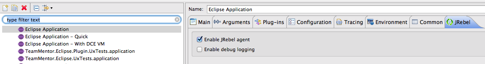

Once that was done, I started the eclipse plugin (under **_Run_** not **_Debug_**)

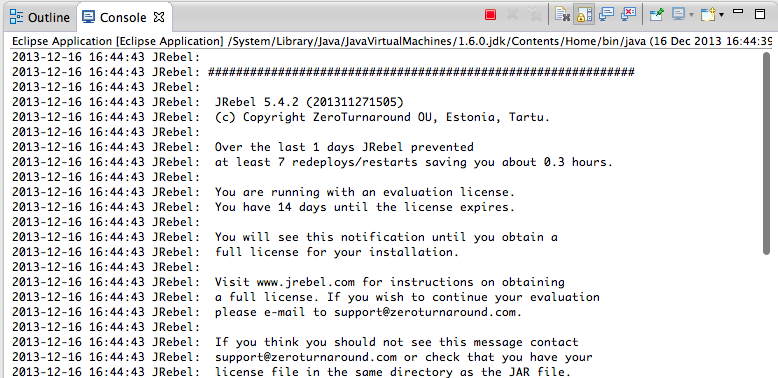

Note: there was this message which can be ignored (for now) since I'm not going to use an Java Project or server in this test/PoC

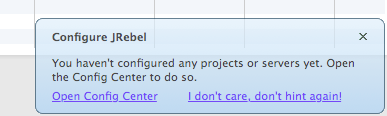

**Part 3: Using JRebel to add new fields and methods**  

With JRebel enabled in the spawned Eclipse instance (the one that loads the [TeamMentor](https://teammentor.net/) Plugin from class files and not a jar), I opened the **_Write TeamMentor Script_** UI  and wrote a simple groovy script that showed the contents of a static String from the **_tm.utils.Consts_Eclipse_** class.

In the screenshot below, the top part (with the java code files) belongs to the host eclipse instance, and the bottom part is the TeamMentor Groovy based Script editor running on the spawned Eclipse instance.

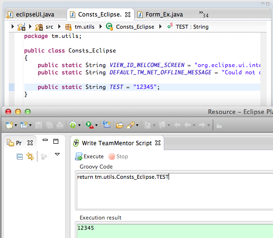

The script above showed how we can write a groovy script that gets the a static value from a class, and the script below shows how to get a list of fields from that class (which at the moment is 3)  

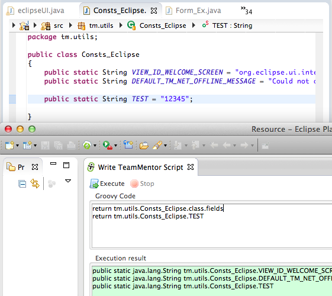

The first test I want to do (which is the one that doesn't work with the current JVM HotSwap) is to add a new static field to that **_Consts_Eclipse_** class, and have access to it, **without needing to restart Eclipse!**

And that is exactly what you can see in the screenshot below :)

Note how there is a new static String field on the top editor (called **TEST_NEW**), which is then listed by the groovy script below:

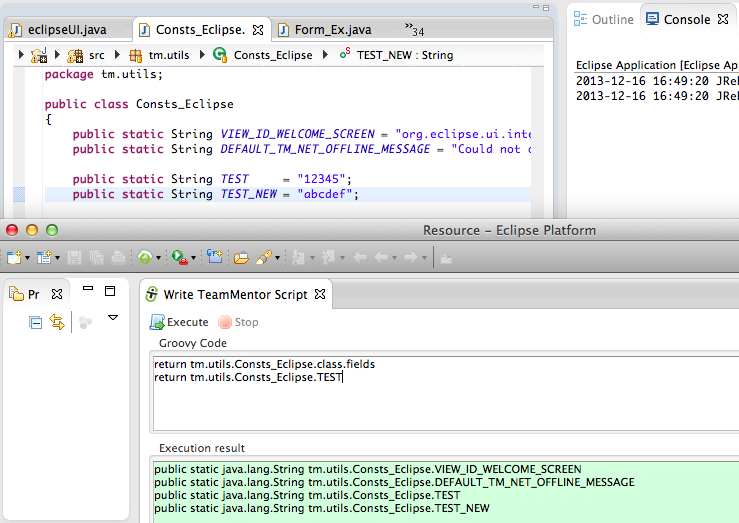

A quick glance at the Console view, will also show JRebel in action:

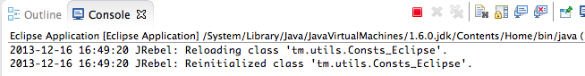

We can use the same technique to have access to its value:  

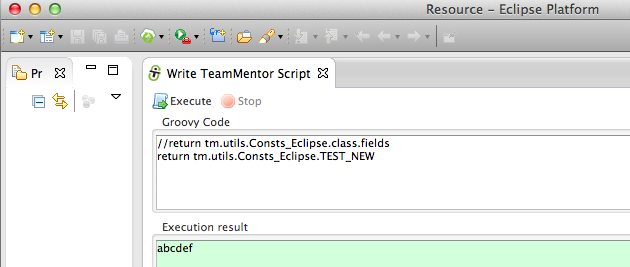

Here is what happens if we try to access a field that doesn't (yet) exist:

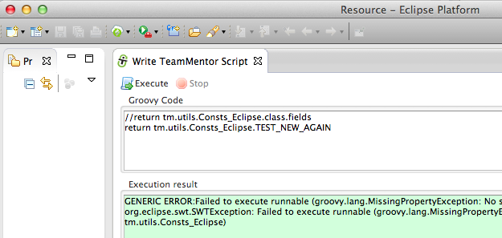

And here is what happens when that 'non existent' field is added:

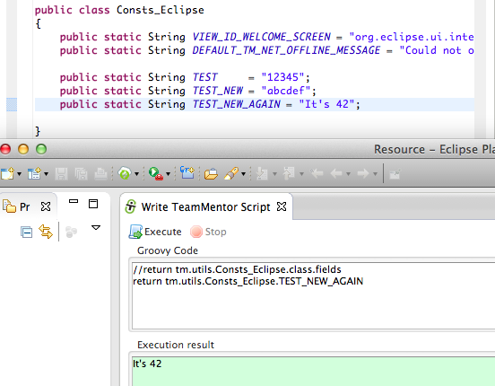

Finally I wanted to see if new methods (instance and static) were correctly handled (since this is the use-case that I need from this technology/technique), and it worked like a charm :)

Note how in the example below, two new methods are added to the **_Consts_Eclipse_** class, which are then used (without Eclipse restart) by the groovy script running on the spawned Eclipse instance:

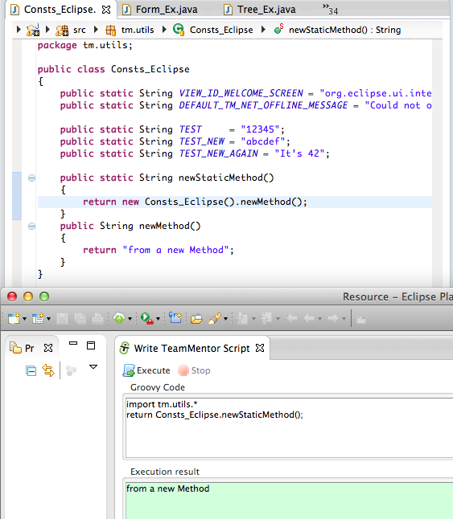

This is REALLY powerful, since I can now work on the Eclipse core APIs (consumed by the TeamMentor plug-in) without needing to restart Eclipse.
