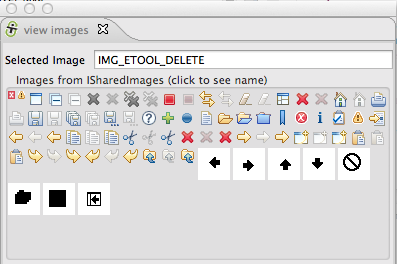
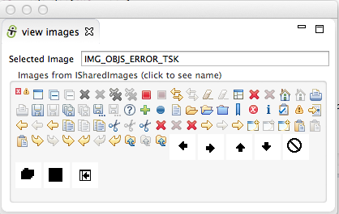
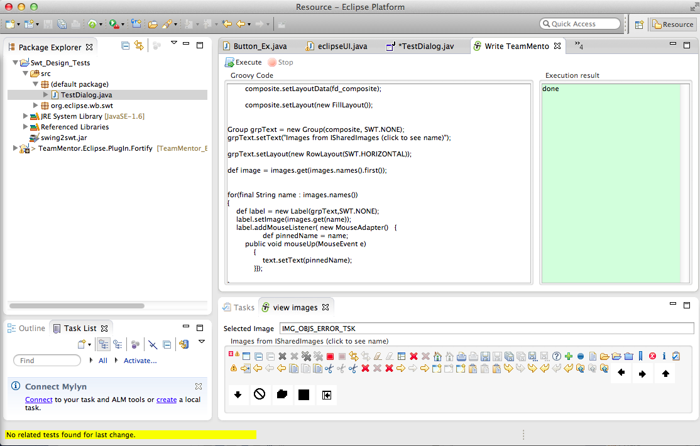
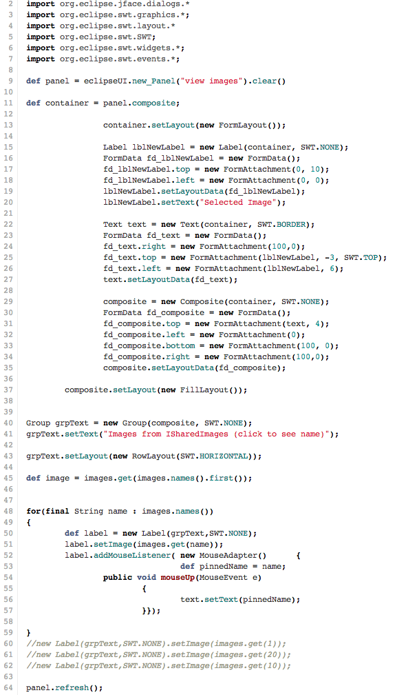

## Groovy Script to create a view that shows the images available in the ISharedImages class

Today I needed to add a couple icons to the [Eclipse Plugin](http://blog.diniscruz.com/2013/12/high-res-images-of-teammentors-fortify.html) I'm working on, and after a quick Googling a bit, I found that Eclipse already includes a number of images with its release, namely via its [ISharedImages](http://help.eclipse.org/indigo/index.jsp?topic=%2Forg.eclipse.jdt.doc.isv%2Freference%2Fapi%2Forg%2Feclipse%2Fjdt%2Fui%2FISharedImages.html) class.

As with the question at [Overview of ISharedImages?](http://stackoverflow.com/questions/7552638/overview-of-isharedimages) I wanted to see a full list of images available, and although that answer points to a couple blog posts that have it (see [here](http://www.vorlesungsfrei.de/kai/index.php?location=eclipse&sub=sharedimages) and [here](http://shinych.blogspot.co.uk/2007/05/eclipse-shared-images.html)) that didn't answer all my needs, since (for example) I also wanted to know if the images were available in the Eclipse versions we currently support (Indigo, Juno and Kepler).

Since I'm still tweaking the eclipse API (in [real-time](http://blog.diniscruz.com/2013/12/adding-and-using-new-api-methods-that.html)) and learning how SWT works, this was a good opportunity to do the same thing using a Groovy script.

After a hitting my head against the wall for a bit (trying to control a number of SWT Layouts :)  ), I was finally able to create what I was looking for (see code at the end of this post [or at this gist](https://gist.github.com/DinisCruz/8009414#file-1-first-pass-with-lots-of-swt-code-groovy)).

Here is the view running in Indigo:

  
Here is the view running in Kepler:

  
As you can see the images are the same (in quantity and looks). Note that I remove the *_MASK images, since I am not sure where they are supposed to be used (and they didn't look that good in that view)

Similar to what I did for the .NET version (see [Added 215 Tango Library Icons to FluentsSharp.BCL and 'PoC - View FluentSharp_BCL Embeded Icons.h2'](http://blog.diniscruz.com/2012/10/added-215-tango-library-icons-to.html)), I also added the feature of showing the currently clicked **_image id_** in the **_Selected Image_** TextBox (helps when looking for a particular image))

To give an idea of how I developed this script, here is the Eclipse instance that contains both the Groovy Script, the created view and an test**_ SWT Designer_** editor (to help me with SWT's syntax). Note that this is the Eclipse instance that is[ running in JRebel mode](http://blog.diniscruz.com/2013/12/adding-and-using-new-api-methods-that.html) (i.e. I can add new API methods to the Eclipse plugin under test, and consume them immediately)

  
[Here is the groovy code](https://gist.github.com/DinisCruz/8009414#file-1-first-pass-with-lots-of-swt-code-groovy) that creates that view, with still with too many SWT plumbing for my taste, and definitely a script that will be dramatically reduced in size once I add the required helper methods to the eclipseUI APIs (like what I did for the code that gets the images from ISharedImages)  :

  

