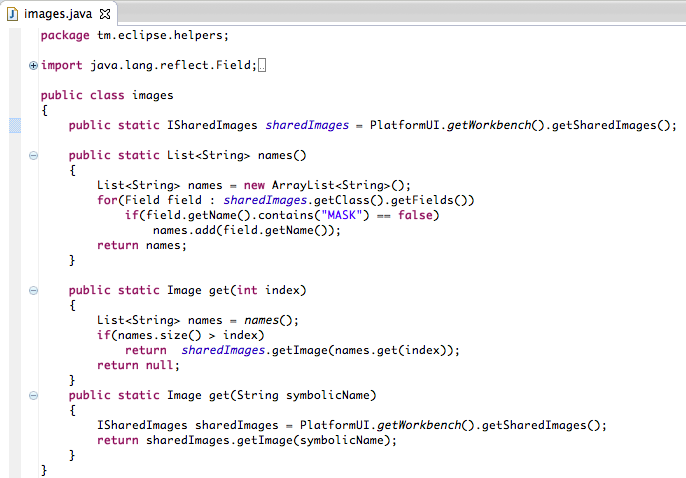
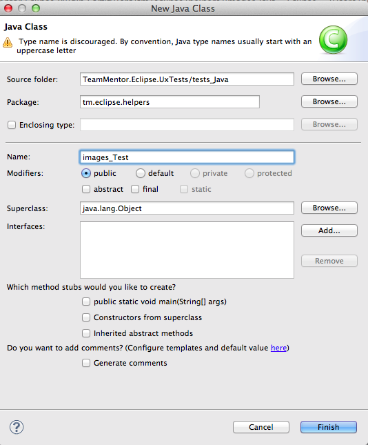
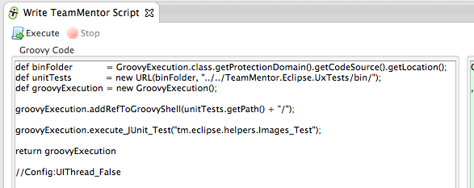
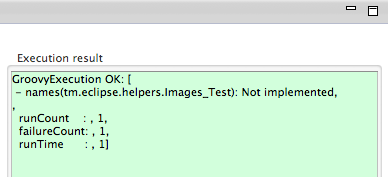
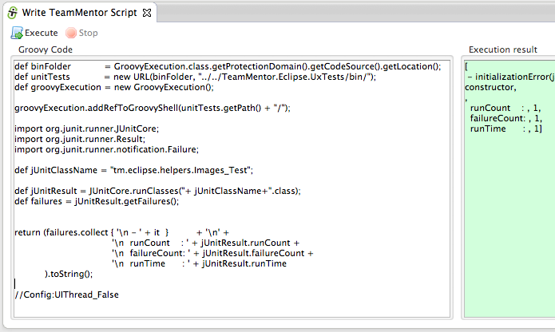
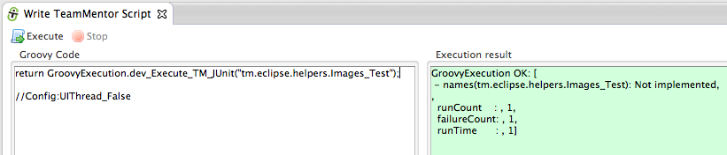
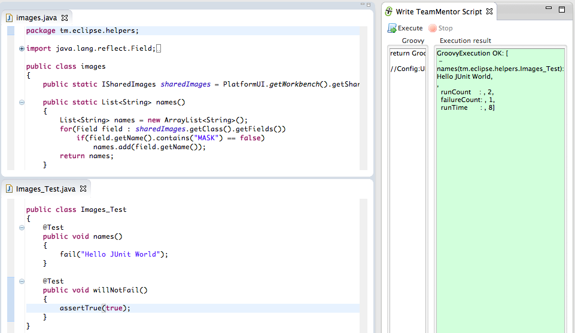
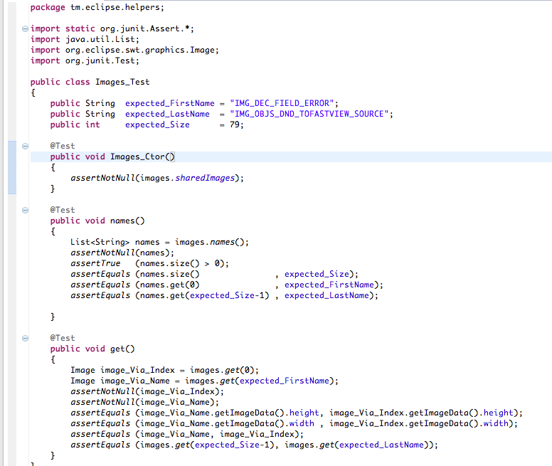
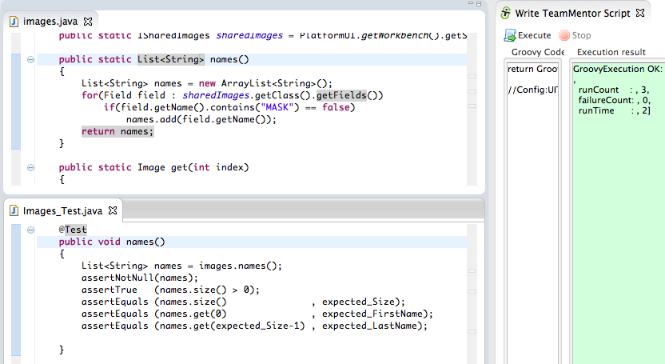

## Executing Eclipse Plugin JUnit tests in real-time without needing to restart Eclipse (with no mocking)

One of the key capabilities that I wanted to have after [Programming Eclipse in Real-Time (using an 'Groovy based' Eclipse Plug-in)](http://blog.diniscruz.com/2013/08/programming-eclipse-in-real-time-using.html), was to be able to run JUnit tests (including tests using STWBot)  in the live (under debug) Eclipse instance (called **_test Eclipse _** below).

This would allow me to code in a very quick/efficient [TDD](http://en.wikipedia.org/wiki/Test-driven_development) workflow, since I wouldn't have to wait 15s to 30s to see execution results for new JUnit tests or major/minor changes to existing JUnit tests.

The good news is that by using the **_GroovyExecution_** API that I wrote for the [TeamMentor Eclipse Plugin](http://installing%20eclipse%20plugin%20builder%2C%20accessing%20eclipse%20objects%20and%20adding%20a%20new%20menu%20item%20that%20opens%20owasp.org%20website/), I was able to dynamically load and run the class files of the JUnit tests to execute, which was already a massive milestone, since that gave me 80% of what I needed. But it was only after [Adding and using new API methods, that are consumed by an Eclipse Plugin under development (without Eclipse restart)](http://blog.diniscruz.com/2013/12/adding-and-using-new-api-methods-that.html) and having [JRebel](http://zeroturnaround.com/software/jrebel/) enabled, that I had the full dynamic environment (where **_changes to the main plugin code_** and **_changes to JUnit test code_** did NOT require an Eclipse restart).

Here is a walkthrough of how it works (still a bit rough around the edges , but already a really powerful workflow).  

As an example lets look at the _tm.eclipse.helpers.images_ class that I added yesterday to the Plugin Apis (when adding the [Groovy Script to create a view that shows the images available in the ISharedImages class](http://blog.diniscruz.com/2013/12/groovy-script-to-create-view-that-shows.html)).

The objective of this class it to make it really easy to get one of the images that is provided via the **_[ISharedImages](http://help.eclipse.org/indigo/ntopic/org.eclipse.platform.doc.isv/reference/api/org/eclipse/ui/ISharedImages.html)_** class

And what we want is to write a JUnit test to check that it is working as expected.

So in the [TeamMentor.Eclipse.UxTests](https://github.com/TeamMentor/TeamMentor_Eclipse_Plugin/tree/develop/TeamMentor.Eclipse.UxTests) project, I added a new **_images_Test_** class,

With a simple test method (which will trigged a **_fail_** exception with the message **_'Not implemented'_**)

Next, I switched to the **_test Eclipse _** (the one opened from the **dev Eclipse**), and wrote this Groovy script:

...which when executed returns this:

... which is the JUnit execution result of the _tm.eclipse.helpers.Images_Test_ JUnit test class (note how the **names** JUnit test method failed with the **_Not Implemented_** exception)

Since in that script there are already a number of helper methods in action, it might be easier to understand what is going on if I de-factored it to this (code [in this gist](https://gist.github.com/DinisCruz/8021684#file-2-de-factored-version-of-1-script-groovy)):

Basically what is happening is that I'm invoking the _[JUnitCore.runClasses](http://junit.sourceforge.net/javadoc/org/junit/runner/JUnitCore.html#runClasses(java.lang.Class...))_ static method from this Groovy execution environment (which is running under the current eclipse).

And since my objective is always to make code/scripting as simple as possible, I added the static method **_dev_Execute_TM_JUnit_** to the **_GroovyExecution_** API, so that we can execute UxTests JUnit tests like this:

Now that we have the ability to execute JUnit tests in the current Eclipse in real-time (did I mention that I don't have to restart Eclipse in between executions :)  ), its time to write the the _Images_Test _test.

Depending if I'm working with two monitors (or not), I usually open the two main files (in this case **_Images.java_** and **_Images_Test.java_** in the  **dev Eclipse**, in a dev environment that looks like this:

In the image above:

  * Top left is the **_Images.java_** file (which is the one we are writing the JUnit test about)
  * Botom left is the **_ Images_Test.java _** (which is the JUnit test file)
  * Right is the Groovy Execution environment with only the  _return GroovyExecution.dev_Execute_TM_JUnit("tm.eclipse.helpers.Images_Test");_ script (which will execute the **Images_Test.java** JUnit test in less than 1 sec :)
    * Note how in this execution result window/text, the **runCount** value is **_2_** and the the **_names_** method fail message is _Hello JUnit World_ (which match the small changes I made to the **_Images_Test.java_** file before I took that screenshot)

The next step is to actually write the _Images_Test.java_ JUnit test ...

... which after a number of executions (all done without restarting Eclipse)

... looked like this:

... with the execution result looking like this:

That JUnit test is a good example of one of the ways I like to do TDD, since I'm also using those tests to check my expectation and understanding of a particular Eclipse API.
