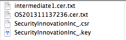

## Saga to sign an eclipse plugin with a code cert

**Signing an** **Eclipse Plugin with a code cert **should be simple right?

Well this is probably one of those cases that maybe it is obvious for others with more knowledge on how java code signing works, but I've spend the good part of two days trying to sign an eclipse plugin, and finally I was able to get it to work.

I will start with the solution (as executed in OSX), and then talk about the problem:  
  
1) MK (SI's tech guru), created the _SecurityInnovationInc_.csr _and _SecurityInnovationInc_.key _files using  

> _**openssl req -new -newkey rsa:2048 -nodes -out SecurityInnovationInc_.csr -keyout SecurityInnovationInc_.key -subj "/C=US/ST=Massachusetts/L=/O=Security Innovation Inc./CN=SecurityInnovationInc."**_

2) MK then sent the _ __SecurityInnovationInc_.csr _to Global Sign (as part of their [Code-Signing cert service](https://www.globalsign.com/code-signing/))

3) After a bit (I think about a day or so) MK received from Global Sign two files: _intermediate.cer.txt _and _OS201311137236.cer.txt_  
_  
_4) MK then send me (via a protected channel) a zip with the following files

  
5) After:  
             a) renaming the _intermediate.cer.txt _into_ __intermediate.cer.txt _, _ _  
_             _b) renaming _OS201311137236.cer.txt _into _OS201311137236.cer _and   
             c) downloading the GlobalSign [Root CA cert from here](https://support.globalsign.com/customer/portal/articles/1217617) into _GSRoot.cer, _  
_  
_    I used the _cat_ command to create the _server-cert.txt _file:  

> _**cat OS201311137236.cer intermediate1.cer GSRoot.cer > server-cert.txt **_

  
6) With the _server-cert.txt  _I used _openssl_ to create a _PKCS12_ keystore (_server-cert.pkcs12) _using:  

> _**openssl pkcs12 -export -inkey SecurityInnovationInc_.key -in server-cert.txt -out server-cert.pkcs12**_

_  
_7) At this stage I was able to verify the PKCS12 keystore (_server-cert.pkcs12)_ using:  

> **_keytool -v -list -keystore server-cert.pkcs12  -storetype pkcs12_**

  
8) Next with the PKCS12 keystore (_server-cert.pkcs12)_, I was able to create the Java keystore (_server-cert.jks_)_ _, using:

> _**keytool -importkeystore -srckeystore server-cert.pkcs12 -destkeystore server-cert.jks -srcstoretype pkcs12 -deststoretype JKS**_

  
 9) And finally sign the designer jars using:  

> _**jarsigner -keystore server-cert.jks artifacts.jar "1"**_

  
10) UPDATE: After I did this, the installation happened as expected on [Kepler, but failed on Indigo](http://blog.diniscruz.com/2014/01/fixing-coding-signing-issue-where.html), The reason is because Indigo doesn't support SHA256 which is what is used by default by Java 7 (v1.7.0_45-b18) version of JarSigner tool. The solution is to use use the _-sigalg_ and _-digestalg_ options to explicitly use SHA1 (the command bellow also uses the _timestamp.dll  _as TSA (Time Stamping Authority))  

> _**jarsigner -keystore server-cert.jks -tsa http://timestamp.globalsign.com/scripts/timestamp.dll -digestalg SHA1 -sigalg SHA1withRSA content.jar "1"**_ 

>   
I hope this helps other who are faced with the same challenge.

  
**So what was the problem?**

First there is massive soup of keystores, Cert types and other Cert related 'things' in play here, with lots of names for the same thing (See the [SSL Converter](https://www.sslshopper.com/ssl-converter.html) article for a nice list of 'possible conversions').

After much reading and mucking about, I think the root cause was the fact that MK didn't use the java's keytool to generate the Java keystore as described in [Java CodeSigning JKS Method - Certificate Generation and Installation](https://support.globalsign.com/customer/portal/articles/1352403) (he used OpenSSL).

This means that I when I tried to create the Java keystore as described in [Java CodeSigning JKS Method - Certificate Generation and Installation](https://support.globalsign.com/customer/portal/articles/1352403) , I didn't work because I wasn't able to import the private cert for SecurityInnovation_.crt.

Another problem was that I didn't have the GlobalSign root CA, which is needed to so that the verification chain works ok.

The solution (as described above) was to:  

  * create a flat file with the 3 certs (_OS201311137236.cer , intermediate1.cer _and _GSRoot.cer_) 
  * use the flat file to create a PKCS12 keystore (_server-cert.pkcs12)_  
  * use the PKCS12 keystore  to create a Java keystore (_server-cert.jks_) 
  * use the Java keystore to sign the Eclipse plugin Jars 

Simple once we know how to :)

I went through a ton of different errors, and for reference here are the tabs I had opened when I finally was able to figure out the solution:  

  * [How to convert .pfx file to keystore with private key?](http://stackoverflow.com/questions/4217107/how-to-convert-pfx-file-to-keystore-with-private-key) 
  * [I am trying to import a private key generated outside of Java into my keystore with keytool.](http://www.jguru.com/faq/view.jsp?EID=532461) 
  * [keytool - Key and Certificate Management Tool](http://docs.oracle.com/javase/1.5.0/docs/tooldocs/solaris/keytool.html) 
  * [Converting .pfx Files to .jks Files](http://www.digicert.com/ssl-support/jks-import-export-java.htm) 
  * [Import a PKCS#12 File into a Java Keystore](http://docs.attachmate.com/filexpress/7.2/command_center_install_html/index.htm?toc.htm?30823.htm) 
  * [How to use SSL with a client certificate in Java](http://quakology.blogspot.co.uk/2009/06/how-to-use-ssl-with-client-certificate.html) 
  * [Can a Java key store import a key pair generated by OpenSSL?](http://stackoverflow.com/questions/2685512/can-a-java-key-store-import-a-key-pair-generated-by-openssl) 
  * [Import client self signed cert into java keystore](http://stackoverflow.com/questions/2767378/import-client-self-signed-cert-into-java-keystore?lq=1) 
  * [jarsigner - JAR Signing and Verification Tool](http://docs.oracle.com/javase/7/docs/technotes/tools/windows/jarsigner.html) 
  * [Java CodeSigning JKS Method - Certificate Generation and Installation](https://support.globalsign.com/customer/portal/articles/1352403)
  * [Install GlobalSign Root CA Certificate](https://support.globalsign.com/customer/portal/articles/1217617)
  * [SSL Converter](https://www.sslshopper.com/ssl-converter.html) 

  

