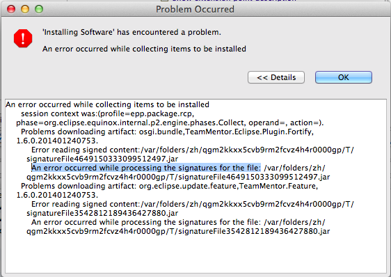
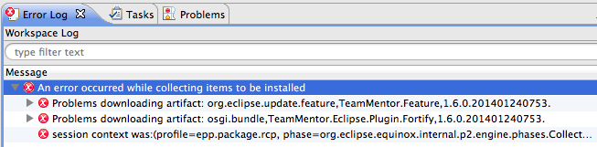
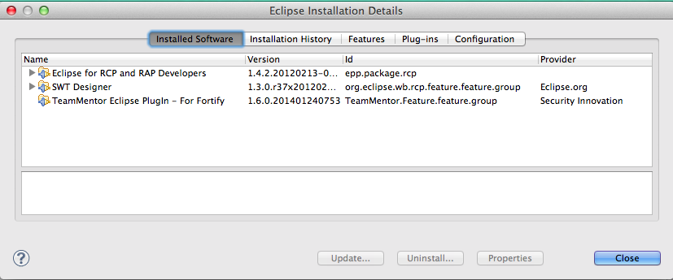

## Fixing Coding Signing issue where Eclipse Plugin didn't install in Indigo

As mentioned in the [Saga to sign an eclipse plugin with a code cert](http://blog.diniscruz.com/2014/01/saga-to-sign-eclipse-plugin-with-code.html) the problems didn't finish after the plugin was signed OK.

During the final QA stage Roman reported that he was [Unable to install plugin on Indigo](https://github.com/TeamMentor/Master/issues/689).

I was able to replicate that issue on a clean install of Indigo, where I got the following error when trying to [install the TeamMentor Plugin](http://blog.diniscruz.com/2013/12/installing-eclipse-plugin-builder.html):  
  

  
... and  

  

  

A bit of research took me to the [Install of plugin fails when signed by Java 1.7 jarsigner](https://bugs.eclipse.org/bugs/show_bug.cgi?id=378155) page, which provided the following explanation:

> _A plugin that is signed with the Java 1.7 jarsigner tool cannot be installed into Eclipse. In 1.7, the jarsigner tool uses the SHA256 algorithm, which doesn't appear to be supported by Eclipse._

The solution was found at [Signing an Eclipse Plugin with Java 7](http://swdevadventures.blogspot.co.uk/2011/09/signing-eclipse-plugin-with-java-7.html) and described in step 10 of [Saga to sign an eclipse plugin with a code cert](http://blog.diniscruz.com/2014/01/saga-to-sign-eclipse-plugin-with-code.html):

Use the _jarsigner__'s__ _ **_-sigalg_** and **_-digestalg_** options to explicitly sign using SHA1:  

> **_jarsigner -keystore server-cert.jks -tsa http://timestamp.globalsign.com/scripts/timestamp.dll -digestalg SHA1 -sigalg SHA1withRSA content.jar "1"_**

  
After that was done (and all 4 jars where signed (the content, artifacts, plugin and feature)), I was able to install the extension ok in Indigo.

Here is the Plugin shown in Eclipse's_ Installed Software _view

  

And here are the signature cert details of the plugin installed:

