##  Viewing Eclipse and SWT objects (Workbench, Display and Shell) using Groovy's ObjectBrowser and using TeamMentor's Plugin ObjectBrowser

Using the Groovy REPL included in TeamMentor's Eclipse Plugin (see [update site ](http://eclipse-plugin-builder.azurewebsites.net/)and more info [here](http://blog.diniscruz.com/2014/01/eclipse-groovy-repl-open-teammentor.html), [here](http://blog.diniscruz.com/2013/12/installing-eclipse-plugin-builder.html), and [here](http://blog.diniscruz.com/2013/12/installing-eclipse-plugin-builder.html)) it is possible to view in real time a number of Eclipse/SWT objects (for example the _Workbench, Display or Shell_)  

**Using Groovy's ObjectBrowser:**  

Let's start with [Groovy's ObjectBrowser](http://groovy.codehaus.org/gapi/groovy/inspect/swingui/ObjectBrowser.html) which I used to use just about every day, since it gave me access to a live view of an particular Object's Fields, Properties (from getters) and Methods.  

To see it in action, open the **_Write TeamMentor Script_** view (if don't have access to it , see [install instructions here](http://blog.diniscruz.com/2013/12/installing-eclipse-plugin-builder.html)) which is basically a Groovy [REPL](http://blog.diniscruz.com/search/label/REPL) (Read Eval Print Loop):

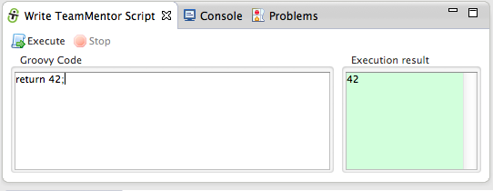

In this Groovy REPL environment, you can write Groovy code that accesses the actual Eclipse objects from the running Eclipse instance:

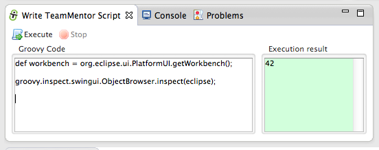

In the script above we feed the **_workbench_** variable to _Groovy's ObjectBrowser,_ which when executed will look like this:

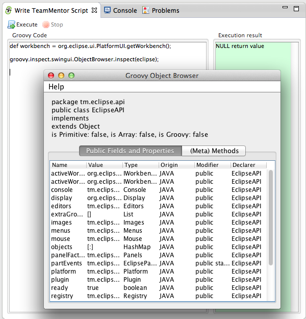

One of the problems with the **_Groovy's ObjectBrowser_** (an _Swing UI_ shell), is that it doesn't allow you to zoom-in into inner/child objects.

So for example if you wanted to see the details of the **_Display_** object, which is exposed by the **_Workbench_** object, you would have to do something like this:

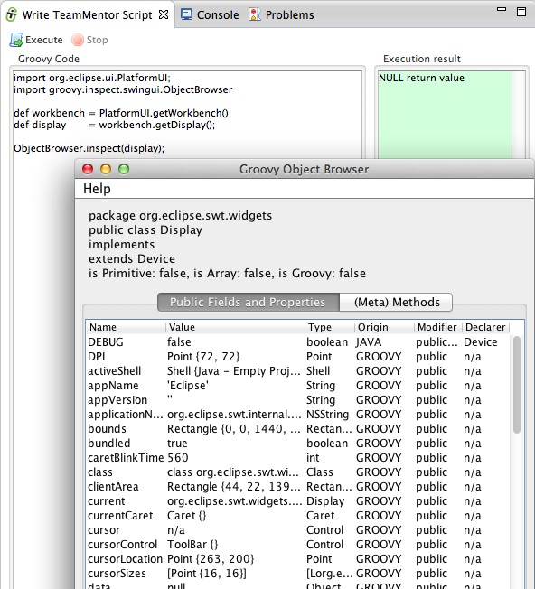

**TIP:** The Groovy REPL is injected with an live instance of the [EclipseAPI](https://github.com/TeamMentor/TeamMentor_Eclipse_Plugin/blob/master/TeamMentor.Eclipse.PlugIn.Fortify/src/tm/eclipse/api/EclipseAPI.java) object which exposes a number of these objects.

For example we could use the **_ObjectBrowser_** to see the **_workbench_**, **_display_** and **_activeShell_** objects like this (using the objects exposed by **_eclipse.workbench_**, **_eclipse.display_** and **_eclipse.shell_**):

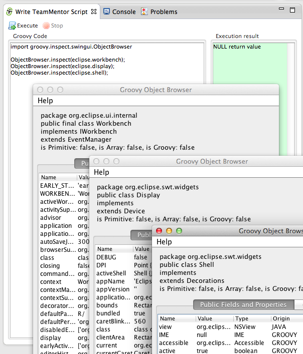

In fact, the _ObjectBrowser.inspect({object})_ is also injected as Groovy method, so we can just use **_inspect({Object})_**:

**Using TeamMentor's Plugin ObjectBrowser**  

Like I mentioned above, although I used to use the Groovy Object browser a lot, I didn't like its limitations, and eventually I was able to use the [simpler SWT API ](https://github.com/TeamMentor/TeamMentor_Eclipse_Plugin/tree/master/TeamMentor.Eclipse.PlugIn.Fortify/src/tm/eclipse)(also shared by this plugin) to create a better version.

To see it in action, you can use this script:

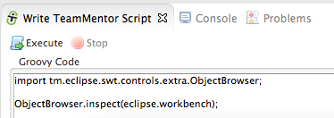

...which will show the new version of the _**ObjectBrowser**_ inside a native Eclipse view:

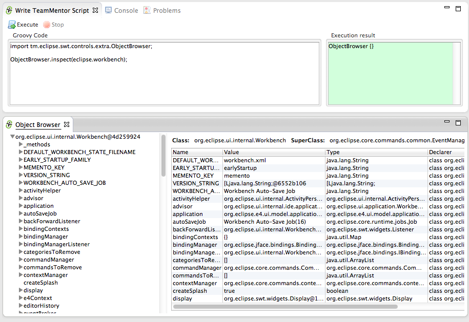

... that can be moved around inside Eclipse (as any other Eclipse view), or even opened up in a popup Shell:

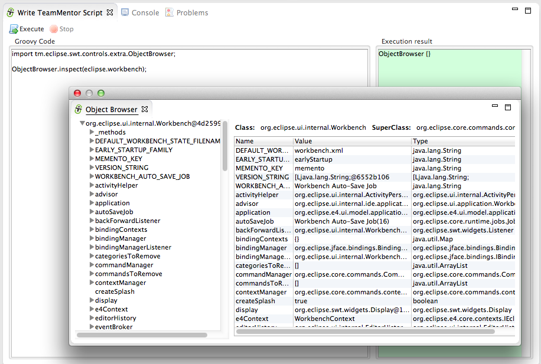

This version of the **_ObjectBrowser_** (as the Groovy one) takes any object as input, and uses refection to show the fields, getters and methods.

On the left-hand side you can see the initial object provided (in this case the live Eclipse **_workbench_** object), which is quite a nice, big and juicy object:

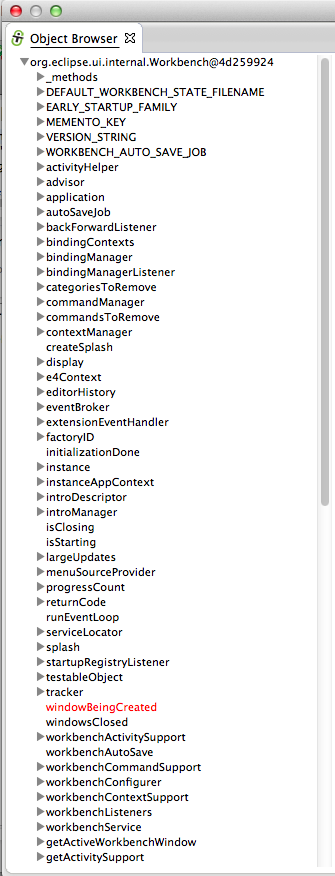

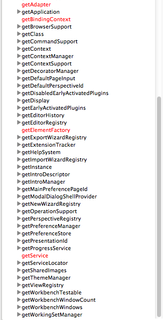

One right-hand side we see a table that shows the fields and getters for the currently selected treeview node

In this case (when **_ObjectBrowser_** opens for the first time), the target shown will be the Eclipse's **_Workbench_** object:

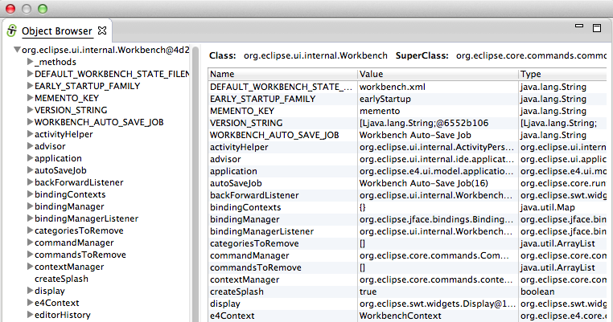

But instead of having to load the **_ObjectBrowser_** again to see the details of an another _Workbench _object (like the **_Display_**), we can just select it form the left-hand side treeview, and its contents will be shown on the right-hand side table:

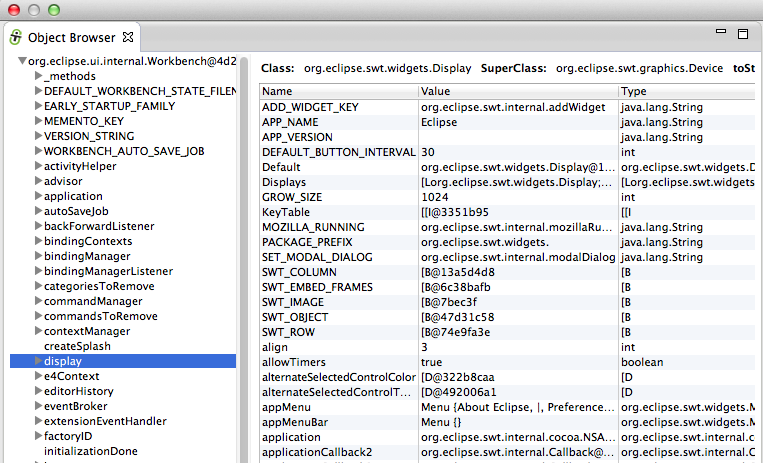

In fact, you can even expand that node, and selecte other nodes to see the values of its fields and getters.

For example there is the **_Display_** object (which is exposed by the **_Workbench_** object):

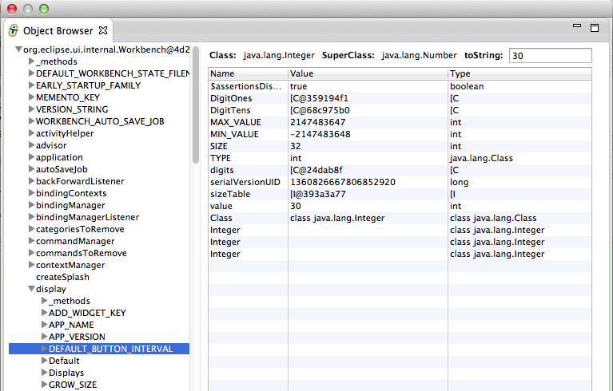

For example here is the current _activeShell_ object (also shown in the **_Groovy ObjectBrowser_** screenshots):

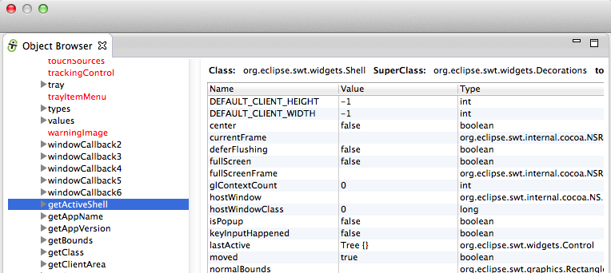

**TIP:** As with the _Groovy ObjectBrowser_ _inspect({Object})_ injected method, there is also a _show({Object})_ method that will open the _TeamMentor's ObjectBrowser_ view directly (with no need to add extra java packages imports):

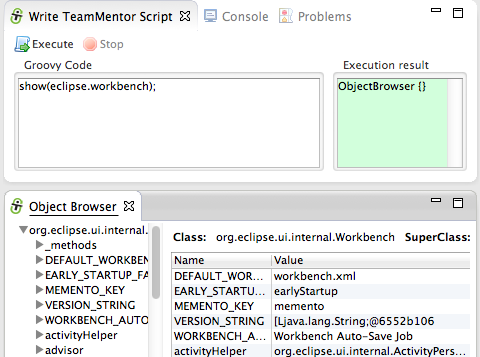

For fun, you can use the **_ObjectBrowser_** to see the fields, getters and methods from an **_ObjectBrowser_** :)

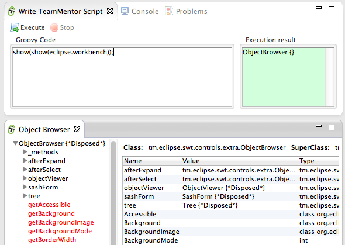

Also useful is the fact that if a _Collection_ (or _Array_) is given to **_ObjectViewer_**, the left-hand-side treeview will show each _Collection_ item on its root.

For example, here are all the current visible/active _Eclipse views_ in the current workbench (the **_eclipse.views.list()_** API call will be explained in another blog post)

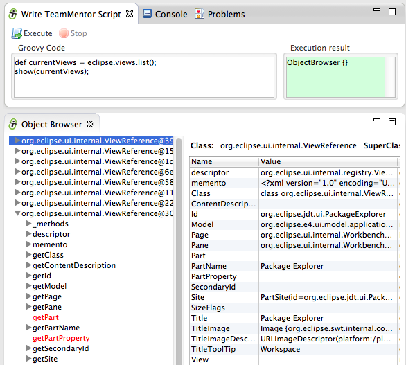

 Here are all the _Eclipse views_ that are currently registered (and available) on this instance of Eclipse:

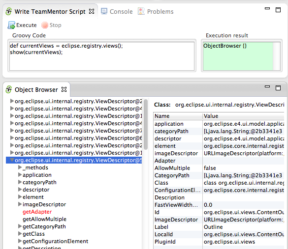

And finally here are all the _Eclipse Editors_ that are currently registed (note that the instance of Eclipse I used to take these screenshots didn't have the Groovy plugin installed, which is why the Groovy Editor doesn't show in the list below):

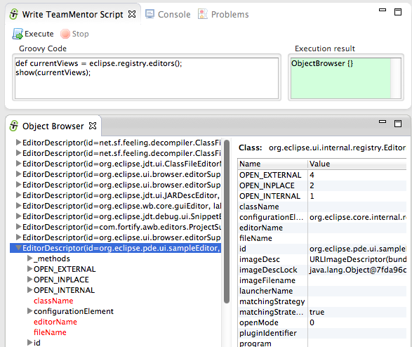

That's it for this post!

Thanks for reading and I hope you see the value in this ObjectBrowser. I would love to have some feedback, so please take it for a spin, and let me know what what you think of it :)

You can use [this update site](http://eclipse-plugin-builder.azurewebsites.net/) to install it on Eclipse Indigo, Juno or Kepler (x32 , x64, Java 6 or Java 7)

Alternatively you run it from the [source code](https://github.com/TeamMentor/TeamMentor_Eclipse_Plugin) or install it offline using a clone of the [update site files](https://github.com/TeamMentor/TeamMentor_Eclipse_Plugin_Deploy)
