## Creating an Eclipse UI to run AngularJS e2e tests using Karma

This post shows how I created a nice set of views in Eclipse to quickly see the execution result of AngularJS e2e (end-to-end) tests, without leaving the Eclipse UI.

The image below shows this UI in action, where:

* The source code of the test is shown in the Eclipse Java editor
* Just below is the **_console out_** of the Karma runner (which is detecting files changes)
* On the top-right is the hooked browser (i.e. the one that will run the tests)
* On the middle-right is the simple AngularJS **_Hello World_** page
* On the bottom-right is the debug view of the hooked browser (which is what you get if you click on the **_Debug_** Button included on the top-right page)

Here are the tools and Eclipse Plugins used to create this UI:  

* [Eclipse Kepler for Java EE Developers](https://www.eclipse.org/downloads/packages/eclipse-ide-java-ee-developers/keplersr1) with:

    * [Eclipse Grovy REPL Scripting Environment 1.6.0](http://marketplace.eclipse.org/content/eclipse-grovy-repl-scripting-environment) ([update site](http://eclipse-plugin-builder.azurewebsites.net/))
    * [AngularJS Eclipse Plugin](https://github.com/angelozerr/angularjs-eclipse)  ([update site](http://oss.opensagres.fr/angularjs-eclipse/1.0.0-SNAPSHOT/))
    * [Nodeclipse](http://www.nodeclipse.org/) ([update site](http://dl.bintray.com/nodeclipse/nodeclipse/0.10.0/))
    * [Ansi Console](http://mihai-nita.net/java/#ePluginAEC) ([update site](http://www.mihai-nita.net/eclipse))

* [NodeJs](http://nodejs.org/) with
    * [Karma](http://karma-runner.github.io/0.10/index.html)

Although the AngularJS and NodeJs Eclipse plugins provide nice helpers and views, they didn't provide (yet) the kind of UI that I was looking for. Namely they didn't support the use of KarmaJS to run AngularJS tests.

But since I now have the ability to quickly manipulate and create new Eclipse views without restarting Eclipse (using the [Groovy REPL script environment ](http://marketplace.eclipse.org/content/eclipse-grovy-repl-scripting-environment)) it was not very hard to create the UI that I wanted (see [Eclipse Plugin that allows the execution of REPL Groovy Scripts (in the current Eclipse Instance) and Fluent API for Eclipse+SWT](http://blog.diniscruz.com/2014/01/eclipse-plugin-that-allows-execution-of.html)).

Basically the brief was to:  

  * Create new (Eclipse) view with a browser showing http://localhost:9879/__karma/ (the KarmaJs browser runner/hook)
  * Create new view with a browser showing http://localhost:9879/index.html (the AngularJS page)
  * Create new view with a browser showing http://localhost:9879/__karma/debug.html (debug view of Karma runner), with an toolbar button to refresh it.

Here is the Groovy code[*](https://gist.github.com/DinisCruz-Dev/9186835#file-eclipse_karma_views-groovy) with the code that creates this 3 Eclipse views:

{lang="groovy"}
    eclipse.views.create("Karma Runner")
             .clear()
             .add.browser()
             .open("http://localhost:9879/__karma/")

    eclipse.views.create("Website")
             .clear()
             .add.browser()
             .open("http://localhost:9879/index.html")

    def view      = eclipse.views.create("Karma Runner - debug ").clear()
                                                                                                    .set.layout.grid();
    def runButton = view.add.toolBar()
                    .add_Button("run", images.get("IMG_TOOL_REDO_HOVER"));

    def browser   = view.add.panel()
                 .set.layout.grid_Grab().add.browser();

    def openKarmaDebug = new Runnable() { public void run()
        {
            Thread.start {
                    browser.open("http://localhost:9879/__karma/debug.html");
                    view.refresh();
                     };
        }};

    runButton.onClick(openKarmaDebug);

    view.refresh();

    openKarmaDebug.run();

    //Config:UIThread_False

Hopefully this script is easier to read (the idea of the Fluent API that I added to the Groovy REPL was allow the easy reading and understanding of scripts like this).

**1) Setting up the environment**

Now lets look at how this environment was setup:

We start with a simple AngularJS project test page that will just show the model-binding capabilities of AngularJS (yes I know that all those JS files should be in separate folders :) )  

Then I opened up [Groovy REPL script environment](http://marketplace.eclipse.org/content/eclipse-grovy-repl-scripting-environment) and wrote the Groovy script shown above:

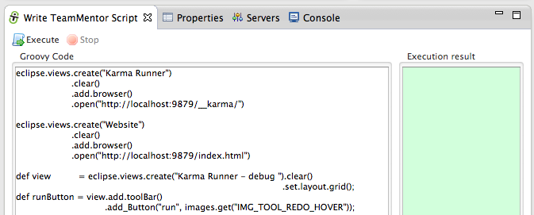

Clicking on _Execute _will create 3 views:

a) the **_Karma Runner_** view:

b) the **_Website_** view:

c) the **_Karma Runner - debug_** view:

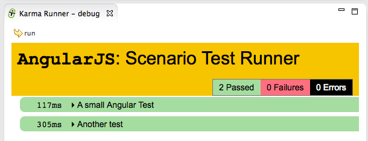

... which (as seen in the first screenshot of this post) looks like this:

Part of this UI (but not created using the Groovy script) is an Eclipse _Console_ with the _'Karma Runner process'_ console out

The AngularJS tests were executed when the **_Karma Runner_** view was opened, because the Karma process (configured via Karma.config.js) is set to wait for new browser's hooks/runners and (on connection or code changes) execute the configured tests.

**2) Making changes to existing tests**  

To see Karma in action, let's make a test fail :)

The current AngularJS page is basically just echoing/binding the contents of the **_Name_** TextBox into the **_H1_** tag:

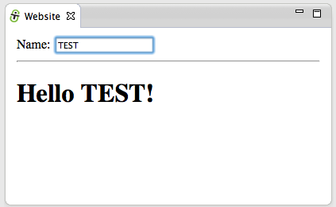

Here is the test that is currently being executed, which is an e2e test that runs on the browser (just like Selenium or Watin).

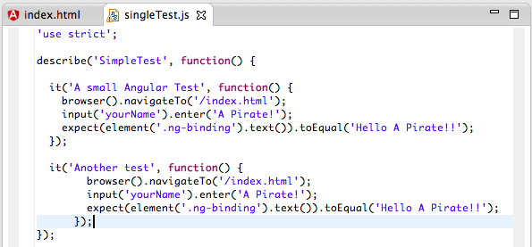

Hopefully this type of Fluent API is easy to read:

  * browser navigates to **_/index.html_**
  * value is inserted into the **_yourName_** input field (the TextBox)
  * the value of the binded element (**_.ng-binding_**) is checked to see if it matches

To make this test fail, let's change just the **yourName** value:

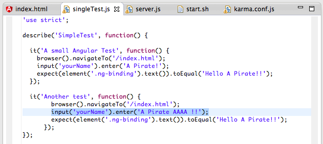

Immediately after saving the test with the changes shown above, Karma refreshes the hooked browsers in order to trigger the execution of the tests.

And as the image below will show, there is now one failed test:

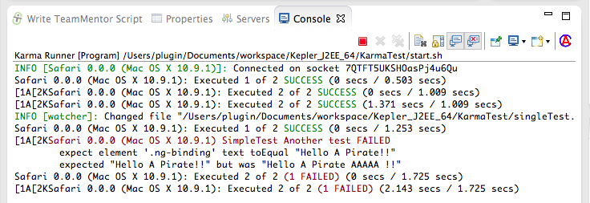

In cases like this, the **Karma Runner - debug** is very useful since it will show more details on what happened, and where the test failed:

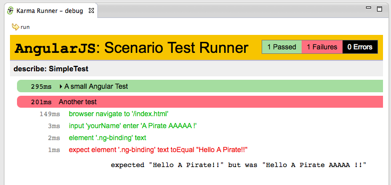

Just to confirm that the page is actually being loaded and the tests are happening in a real browser instance, if we add an Javascript alert to the current test:

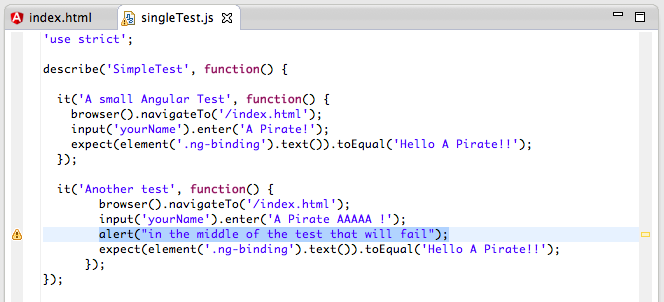

... we will get an alert box in the  **Karma Runner - debug** (note that on the screenshot below we are seeing the image of the final state of execution of the previous test (in this case the _'A small Angular Test'_)

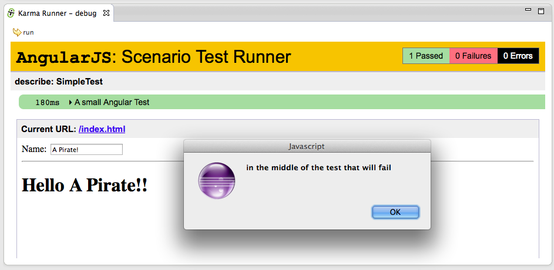

**3) Hooking multiple browsers and only failing on Firefox**  

In order to run the tests in multiple browsers all we need to do is to open the *http://localhost:9879/__karma/* page (in the target browser), and a test execution will be triggered.

Note how on the image below:  

  * Eclipse is in the background (containing the views previously created and showing the **_console out_** of the Karma test runner process)
  * There are 3 stand lone browser windows (Chrome, Safari and Firefox)
  * Firefox (top most window) shows the tests being executed (in green the test executed, in yellow the test being executed)

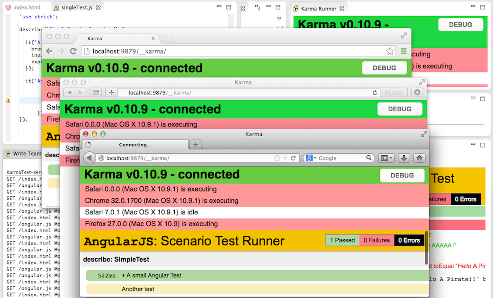

After execution, a quick look at the Karma runner shows that the modified test failed (as expected) on all browsers:

Just to make sure all is working as expected, let's create a test that will fail only in one browser.

For example Firefox is the only one that has defined the **_navigator.userAgent.contains_** Javascript function (so we can use this to detect Firefox, and create a test that will only fail if executed inside it):

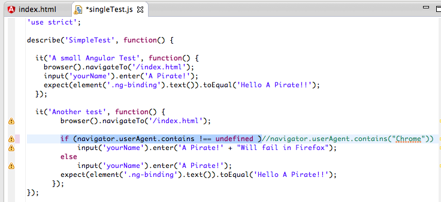

After saving the changes, the tests will be executed on all 4 browsers, with the one test that failed being the one executed in Firefox:

Refreshing the Firefox debug runner, shows the failed test and assert:

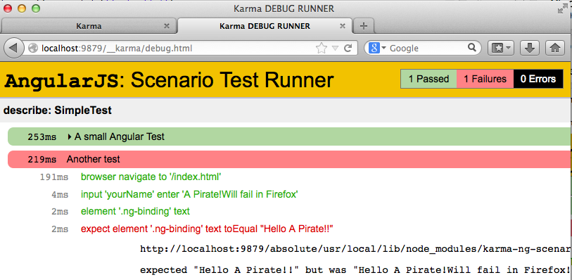

**4) Setup**  

In addition to creating the views programmatically, I also setup an Eclipse _Run configurations_ for **_NodeJS_** and an _External Tools Configuration_ for **_KarmaJS_**.

The NodeJS configuration was done here:

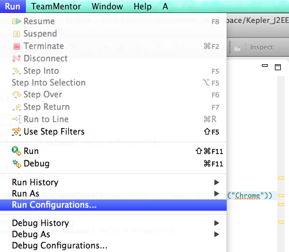

... where I created a Node Application runner that was pointed to **_server.js_**

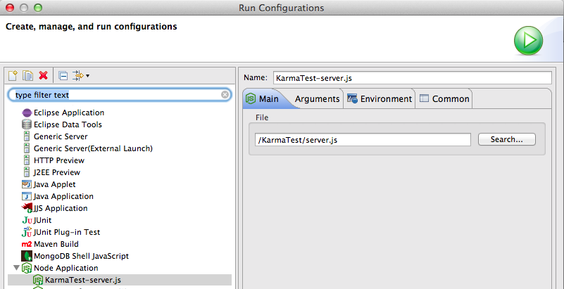

... which contains a simple NodeJS web server (we could also had used NodeJS Express, but that would had added a lot of other 'stuff' to this project)

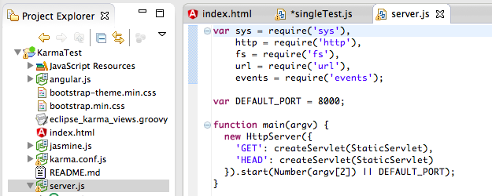

The KarmaJS config was done as an **_External Tools Configuration_**

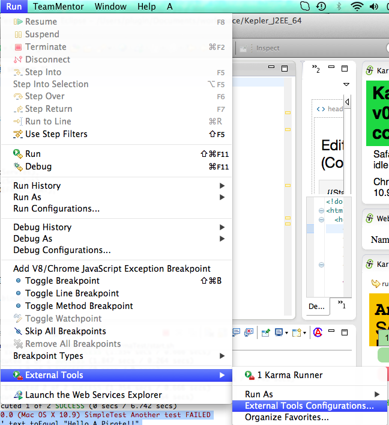

... where I simply run the **_start.sh_** bash file

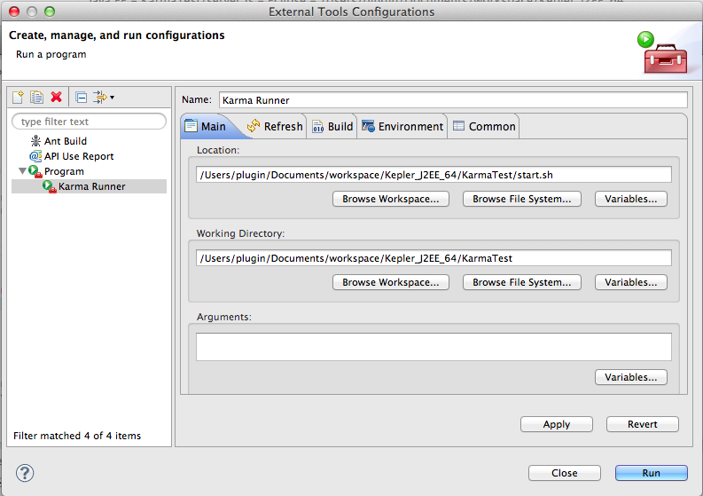

... which starts **_KarmaJS_**:

... using this simple **_karma.conf.js** configuration

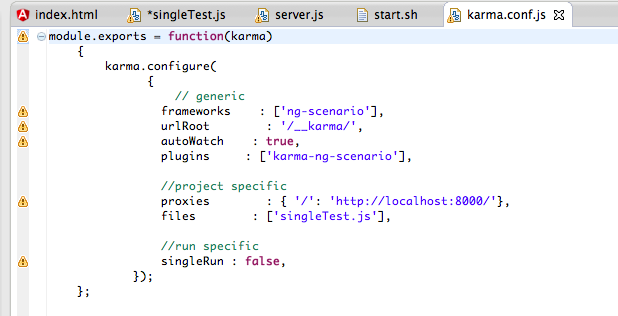]

Note: I started the Karma process like this because there was an issue with **_KarmaJS_** finding the **NodeJS** executable from Eclipse (and at the time I didn't had time to debug why that was happening)  
**External References:**

  * [AngularJS docs on E2E Testing](http://docs.angularjs.org/guide/dev_guide.e2e-testing)
  * [AngularJS Testing with Karma and Jasmine](http://www.tuesdaydeveloper.com/2013/06/angularjs-testing-with-karma-and-jasmine/)
  * [Test runners for AngularJS - how to run the tests from eclipse IDE and CI server without too much complication?](http://stackoverflow.com/questions/21673376/test-runners-for-angularjs-how-to-run-the-tests-from-eclipse-ide-and-ci-server)
  * [How to run KarmaJS from Eclipse](http://litebyte.net/blog/how-to-run-karmajs-from-eclipse/)
  * [Setting-up AngularJS, Angular Seed, Node.js and Karma](http://bardevblog.wordpress.com/2013/07/28/setting-up-angularjs-angular-seed-node-js-and-karma/)
  * [Can't run e2e tests with karma (for angular)](http://stackoverflow.com/questions/17408104/cant-run-e2e-tests-with-karma-for-angular)
