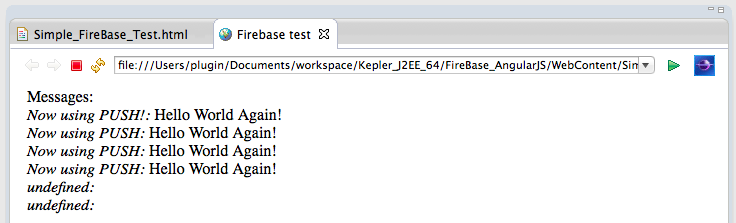
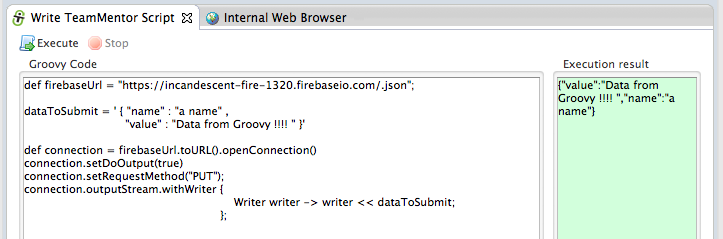
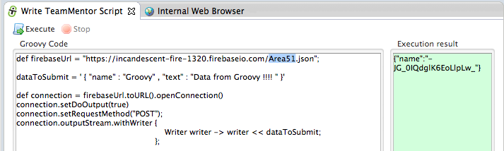

## Using Firebase to sync data with a webpage (via Javascript, REST and Firebase Admin panel)

If you haven't seen the [Anant Narayanan](https://twitter.com/anantn) presentation on [AngularJS conference](http://ng-conf.org/) called [Building realtime apps with Firebase and AngularJS](http://www.youtube.com/watch?v=e4yUTkva_FM) you are missing something good.

[Firebase](https://www.firebase.com/) really seems to fix one of the pain points that I currently have in client-server development, which is _how to send/synchronise data across multiple clients (including the server)_.

I first heard about Firebase from the **_Wire up a Backend_** example that can be found at [http://angularjs.org](http://angularjs.org/), and today I was able to give it a test drive (since I want to use it on the AngularJS front-ends that I'm currently developing for [TeamMentor](https://teammentor.net/))

**1) Creating an Firebase account**  
**  
**Lets start with creating an account and following the [Firebase 5 minute tutorial](https://www.firebase.com/tutorial/).  
**  
**The process of creating an account is just a case of going to [https://firebase.com](https://firebase.com/)

... choosing a username and password (there is also the option to create an account based on an GitHub account)

  
... and that's it:

  
Firebase by default creates a test app, which can be immediately accessed by clicking on the blue _View Firebase _button:

**2) Firebase tour**  
**  
**On first load of the Firebase control panel, we are presented with the offer to take a tour, which is a great way to understand the basics of how it works.

  
The first step of the tour is to add some data:

  
... directly on the current's App data viewer:

  
After we click on the **Add **button, we will see that our data is now part of this Firebase App data stream:

  
Next (after clicking on the **See it in action **link), we get this mini chat application with 3 messages:

  

If we add a new message:

  
... and look back to the Firebase admin panel, we will see the 4 messages (3 added by the **_Sample Chat Application_** and the one I added manually)

  
The final step of the tour is to make a change directly on the Firebase admin panel:

  
... and confirm that the value was _automagically _changed in the **_Sample Chat Application_** (in real-time with no user interaction)

**3) Creating a simple Html/Javascript page to test it out**  
**  
**Note: The next set of example will use code snippets provided by the Firebase [Web Quickstart Guide](https://www.firebase.com/docs/web-quickstart.html)

  
Since I'm going to use Eclipse (Kepler), the first step is to create a new **_Static Web Project_**

  
... with a simple HTML inside:

  

... containing the just the **_firebase.js _**script import and a simple data setter:

  
To see this in action inside Eclipse, I opened up the admin Url in a Browser window (I wonder how long until an Eclipse Firebase plugin is created), and I logged in:

  
**  
****4) Setting and Pushing data**  
**  
**At this stage I had the Html at the top and the Firebase admin panel at the bottom (note the required full url in the **_var myRootRefnew Firebase(...)_** Javascript code):

  
Next step was to open a Web Browser with the test page:

  

  

  

... which set the Firebase server side value to "Hello World!" (I have to say it made me a bit nervous to see how easy it was to completely remove an entire Firebase dataset (I wonder if there are backup or transaction logs for Firebase data))

  
Next step was to try setting some name-value pairs (i.e. a typical JSON string):

  
... which looked like this after execution (note that I didn't refresh the Firebase admin panel (it also uses the WebSocket technology to keep itself up-to-date))

  
Next I tried the **_push_** method (which behaves like an array and was the technique used in the chat example):

  
Here is the execution result (note how there is now an extra **_TreeNode_** with the data provided)

**5) receiving events**  
**  
**So far we have been setting/pushing data into Firebase, but what is also really powerful, is that we can subscribe to server-side events, and update the browser/ui when content changes.

The example below shows how to get a callback every-time a new item is added:

  
Now on refresh (screenshot below), the new children will be shown on the page:

  
One observation, when we subscribe to the _child_added _event,_ _any changes made directly in Firebase's admin panel:

  
... will only be seen when we refresh the page (where all items are viewed as new children)

  
To see the changes in real-time, we need to change the event to _child_changed :_

  
Now (on refresh) we get an empty list:

  
... but if the content is changed on the Firebase admin panel:

  
... the _child_changed_ event is triggered, and we will the new content changes on the browser (without page reload)

**5) Consuming and Sending events using REST API**  
**  
**Now that we can create and consume Firebase events using Javascript, it is time to try their REST API.

For that, I'm going to use the [Eclipse Grovy REPL Scripting Environment 1.6.0](http://marketplace.eclipse.org/content/eclipse-grovy-repl-scripting-environment) so that I can do it directly from Eclipse

Note: most scripts shown below are on [this gist](https://gist.github.com/DinisCruz-Dev/9193091)

The first test was to get the current data set, which is easily retrieved via a simple GET request to the Firebase url for the current application (with a **.json **appended to in the end of the admin url):

  
Since we are in eclipse, here is the code to open the **_JavaScript Editor_** programatically with the json data received:

  
By default the data received from the server has no formatting:  

  

  
But since we are inside the Eclipse  **_JavaScript Editor_**  if we assign it to a variable, we can easily format it:

  
After doing this, I discovered that if we pass a _?print=pretty _to the Firebase url:

  
... the received json data will already be nicely formatted:

  
In the example below I used the Groovy REPL _Execution result_ window to see the formatted json data:

  
Next thing I wanted to try was to see how a REST change would be shown in real time in the browser.

Because my next REST request will use the HTTP PUT command (which is equivalent to the Firebase **_set_** Javascript function), I changed the Html page to display and listen for Firebase _values _(vs arrays with name-value pairs)

Note the **_snapshot.valueOf().val() _**command below:

  

After browser refresh, this is what the test page looked like (with the current **_message_** value being set by Javascript on page load):

  
Next I used the Groovy script below to send a PUT command (I could also had used the [Groovy HttpBuilder](http://groovy.codehaus.org/HTTP+Builder) or the [Java Firebase](https://www.firebase.com/docs/java-api/javadoc/index.html) libraries):

  
When executed, this script will change the value of the current Firebase app to _"Data from Groovy!!!!"_, which will be shown in real-time (i.e. no browser reload) in the opened test page:

  
We can also submit (i.e. PUT) name-value pairs:

  
... which will look like this on the Firebase admin panel:

Next test was to see how to use POST (instead of PUT) on the REST API (in order to replicated the Firebase _push _command).

To see the result, I changed back the html page to handle items (vs 'a value'), and changed the **_on_** event hook to be **child_added**:

  
On refresh, this is what the test page looks like:

  
... and if we send data using POST on the REST call:

  
... we will get a callback in real-time (again with no browser refresh):

A real cool feature of Firebase is how easy it is to create new **_namespaces_** (or areas/objects) for specific types of data.

For example, if I add _Area51 _to the firebase url (see the highlighted text below)

  
... the data will now be stored inside an **_Area51_** object/area/namespace on the current Firebase app:

**6) Programatically add new items to the Chat window**  
**  
**Finally coming back to the chat window (see below), when I saw that example, one of my first questions was **_"How to programmatically submit data to it?_**

  
Hopefully by now you should have a clear picture of how to do it, but just in case, here is how I did it :)

For reference, here is what the data looks like:

  

Here is the script that submits the POST data to this chat (the key is in the **_chat.json_** part of the URL)

  
And now, after executing the above script, the chat window will contain our new message:

  

  

**6) What about XSS**  
**  
**Although both **_chat_** application and test html page are not vulnerable to XSS, it is very easy to create an DOM based XSS in this type of real-time apps.

See my next post on [XSS considerations when developing with Firebase](http://blog.diniscruz.com/2014/02/xss-considerations-when-developing-with.html) for more details on this topic. 
