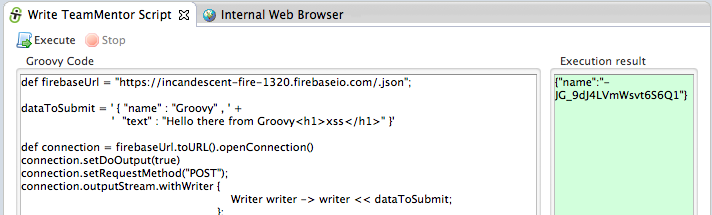
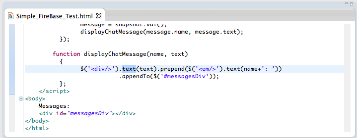
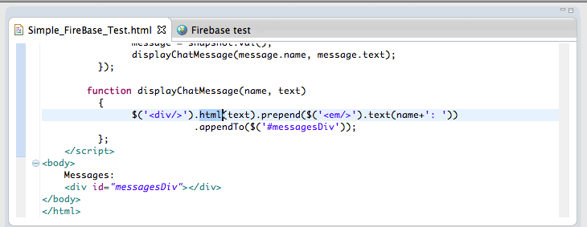
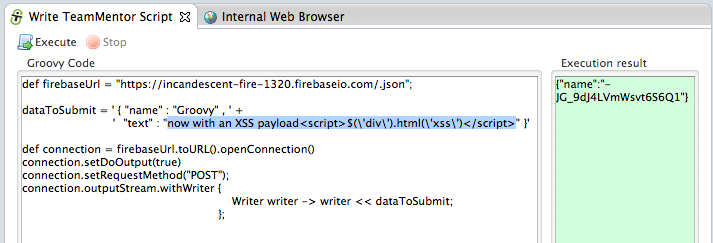
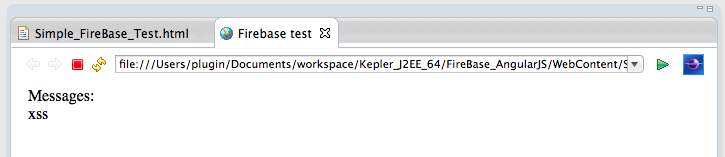
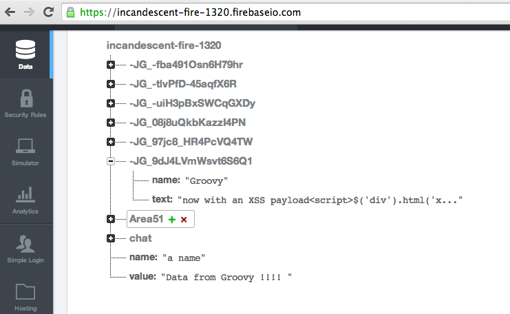

## XSS considerations when developing with Firebase

Following my previous post on [Using Firebase to sync data with a webpage (via Javascript, REST and Firebase Admin panel)](http://blog.diniscruz.com/2014/02/using-firebase-to-sync-data-with.html), here are a couple security notes and 'areas of concern', that should be taken into account when developing real-time apps with [Firebase](https://www.firebase.com/):  

* Firebase will reflect any payloads sent to it
* We are talking about DOM based XSS
* The current browsers XSS protection does not protect against DOM based XSS
* It is very easy to create a vulnerability (as you will see below, all it takes is a simple change from _.text() _to _.html()_)

  * If powerful DOM based API-manipulation frameworks are used (like jQuery), there are many more injection points (sinks)

* By nature of Firebase applications, the XSS exploit will have wormable capabilities (i.e. it will be able to distribute and self-propagate itself VERY quickly)
* Current static-analysis tools will struggle to pick up this type of vulns

Note: I think (and I will want to double check this) that if is safe (i.e OK) to put received Firebase data/payloads, on an AngularJS auto-binded location/variable (for example **_{{name}} : {{message}}_**)

Let's use the chat application provided by Firebase to see this in action (note that as you will see below, the chat application as provided by Firebase, is secure and not exploitable)

**1) Example of safe code**  

If we send an simple HTML payload (like the one shown below) to Firebase:

... by default, the output will be correct encoded, and the HTML will not be rendered (see below):

The reason this happened (the encoding) is because the _jQuery.text(...)_ function was used (see below) when creating the HTML Element to add to the page:

**2) Example of unsafe code**

But if we change _jQuery.text(...)_ to _jQuery.html(...)_:

... and a more interesting payload is injected (in the case below _$('div').html('xss')_ which will change the html content of all **_divs_** to **_'xss'_**)  

... we will see that the payload was triggered on our local test page:

A quick look at Firebase's data feed, will confirm that the payload is currently stored (and ready to be deployed/pushed to any vulnerable clients).

**Not really a Firebase problem**

It is important to note that this is not really a problem with firebase, since they are just storing data.

That said, due to the dangerous outcomes of such exploits, I would be interesting if some 'defense in depth' capabilities (and validation) could be added to the data stored (I wonder if there is any filtering or sanitization capabilities in Firebase?) 
