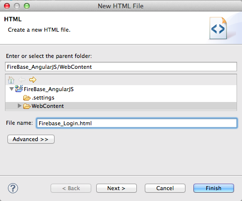
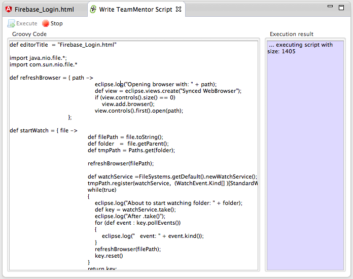
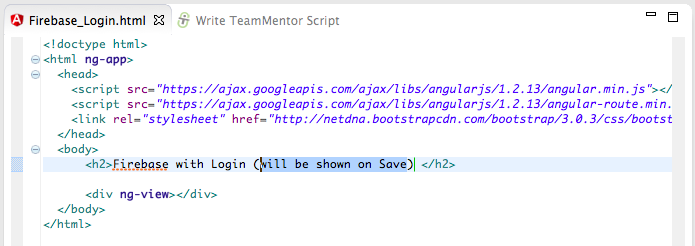
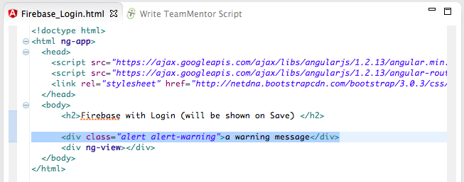
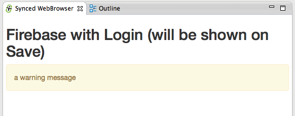

## Eclipse Groovy REPL script to sync a Browser with file changes (with recursive folder search via Java's WatchService)

Since I am using Eclipse to develop using [AngularJS](http://blog.diniscruz.com/search/label/AngularJS) (see [Creating an Eclipse UI to run AngularJS e2e tests using Karma](http://blog.diniscruz.com/2014/02/creating-eclipse-ui-to-run-angularjs.html)), I needed a way to refresh the browser window every-time I made changes to any AngularJS related file (note that due to the nature of the AngularJS projects, I need the change to trigger on any change made inside the root folder and all its subfolders).

Since there didn't seem to be an easy way to do this (_'auto browser refresh on file changes'_) in  Eclipse, I used the [Eclipse Grovy REPL Scripting Environment](http://marketplace.eclipse.org/content/eclipse-grovy-repl-scripting-environment) to develop a script/macro that:  

* Based on a title of an opened eclipse editor file:
* ... find the full path of that file, and:
* ... create a[ Java WatchService](http://docs.oracle.com/javase/7/docs/api/java/nio/file/WatchService.html) that monitors the file's folder and subfolders, and:
* ... when a StandardWatchEventKinds.ENTRY_MODIFY is received :

  * Create/Open a new Eclipse view with a browser (called **_Synced Browser_**), and:
  * ...refresh the index page

For reference here is the groovy code for this script ([gist here](https://gist.github.com/DinisCruz-Dev/9258689)):

Originally I had tried to use Eclipse file change events (like on this [SO thread](http://stackoverflow.com/questions/6507937/how-can-i-hook-into-eclipse-editor-events-in-my-own-plugin)), but that didn't work as well as the WatchService.

A next step is to create a mini UI to allow the configuration of the target files (maybe as a view added to the next version of the [Groovy REPL Eclipse](http://marketplace.eclipse.org/content/eclipse-grovy-repl-scripting-environment) plugin)

**Seeing it in action**  

Here is how to test this script:

1) create a Web project with an Html file on it:

2) run the Groovy [code](https://gist.github.com/DinisCruz-Dev/9258689) in the REPL window (note that the image below is using a different root file and the version of script is an [older one](https://gist.github.com/DinisCruz-Dev/9214909) (which didn't contain the recursive folder monitoring)):

... on execution you will see a new view (called _Synced WebBrowser_) show up in your current Eclipse instance.

3) make some changes on the Html file

4) and note that the **_Synced WebBrowser_** view will be refreshed automatically (it takes about 500ms to 1s for the change to be picked up (see this [SO answer](http://stackoverflow.com/a/18362404/262379) for why I had to use the **_SensitivityWatchEventModifier.HIGH_** setting on the WatchService))

5) if you open the **_TeamMentor Console_**, you will also see a number of log messages that help to see what is going on:

6) here is another example where I added a new [Bootstrap](http://getbootstrap.com/components/) css div:

7) which was immediately (~500ms) shown on save

8) note that the the log message shows the events being triggered and the resetting of the **_WatcherService_**:

