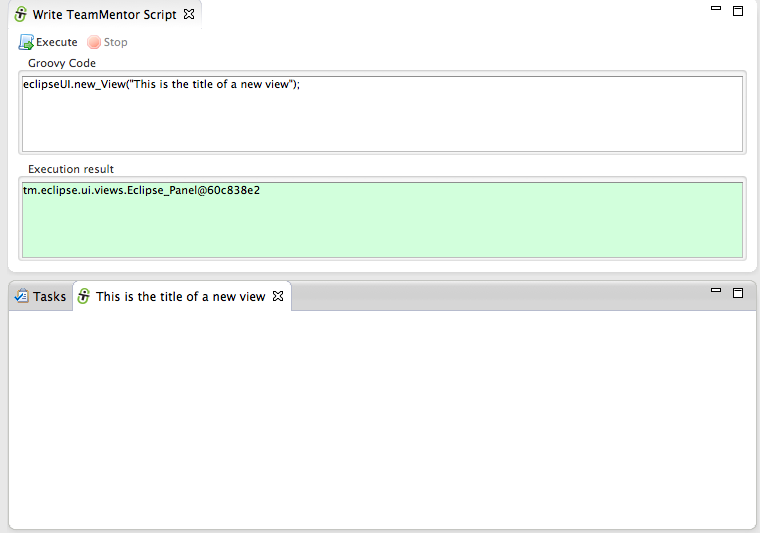
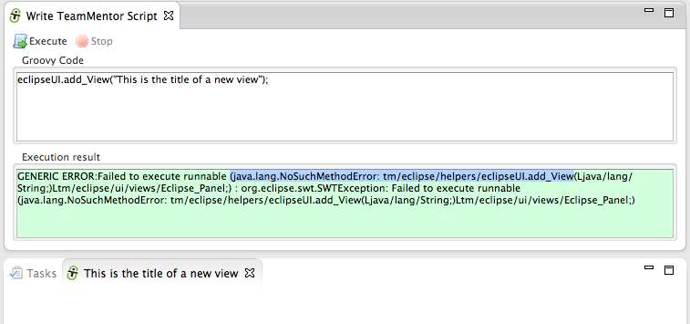
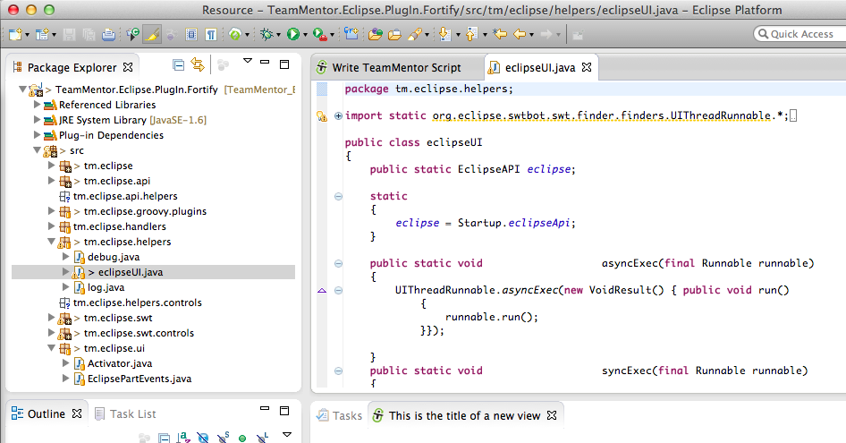
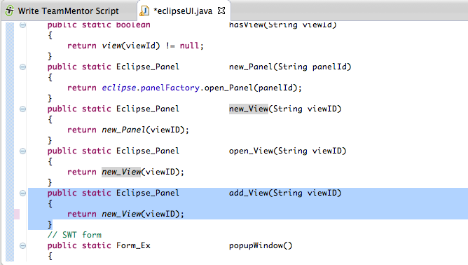
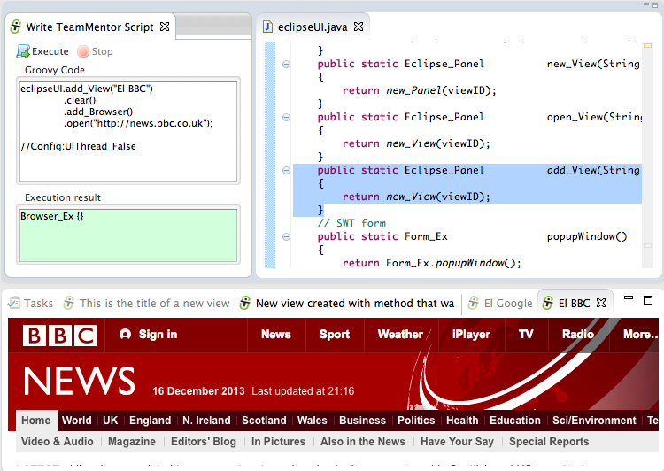

## Adding and using new API methods, that are consumed by an Eclipse Plugin under development (without Eclipse restart)

This is a variation of the example shown in [Using JRebel to HotSwap new Static String fields in an Eclipse Plugin (without Eclipse restart)](http://blog.diniscruz.com/2013/12/using-jrebel-to-hotswap-new-static.html) and its such a cool/powerful workflow that it deserves a dedicated blog post.

Part of the [Eclipse Plug-in development toolkit](http://blog.diniscruz.com/2013/11/si-open-sources-eclipse-plugin.html) I'm working on, are couple APIs that are inspired/based on my previous work at the [OWASP O2 Platform](http://blog.diniscruz.com/p/owasp-o2-platform.html)'s [FluentSharp APIs](https://fluentsharp.codeplex.com/) (available [from NuGet](http://www.nuget.org/packages?q=FluentSharp)).

The core idea of these Fluent APIs is to simplify to the maximum the code required to perform a particular action.

  
This means that if you were **programming an Eclipse UI, and (for example) you wanted to open a view**, you shouldn't need a lot of [commands and instructions](http://www.eclipse.org/articles/viewArticle/ViewArticle2.html).

You should just be able to say: **_eclipseUI.new_View("{view title}");_**  

Which is one of the APIs that I've added to the [eclipseUI.java](https://github.com/TeamMentor/TeamMentor_Eclipse_Plugin/blob/develop/TeamMentor.Eclipse.PlugIn.Fortify/src/tm/eclipse/helpers/eclipseUI.java#L89) file ([exposed to the Groovy execution environment](https://github.com/TeamMentor/TeamMentor_Eclipse_Plugin/blob/develop/TeamMentor.Eclipse.PlugIn.Fortify/src/tm/eclipse/groovy/plugins/GroovyExecution.java#L58)) and can be used like this:

  
What you see above is the Groovy environment described on [Programming Eclipse in Real-Time (using an 'Groovy based' Eclipse Plug-in)](http://blog.diniscruz.com/2013/08/programming-eclipse-in-real-time-using.html) executing the **eclipseUI.new_View("This is the title of a new view"); **script, which will create a new view (shown in the bottom panel).

My objective is to create an API (which is really a [DSL](http://en.wikipedia.org/wiki/Domain-specific_language)) that is very intuitive and easy to use.

That means that there are cases where it makes sense to have repeated methods. For example I have already found myself trying to use the method _eclipseUI.__add_View__("{view title}")_; instead of the existing _eclipseUI.**new**___View__("{view title}")_;  (i.e for some reason, there are cases/workflows where I fell calling that method _**new**___View _and others **_add_**__View_).  

Before the [JRebel HotSwap capabilities](http://blog.diniscruz.com/2013/12/using-jrebel-to-hotswap-new-static.html), I would had needed to:

1) go to the main Eclipse (the one running in the background and with the Eclipse plugin source code)  
2) add/change the new API Method  
3) start a new instance of Eclipse  
4) see the result  
5) make changes/fixes to the code, and (depending on the location of those changes) restart Eclipse

In fact, since I'm trying to do as much TDD as I can, most of the development should be done using Unit Tests (which adds another layer of execution/complexity). And since Eclipse start-ups can take from 10s to 50s, this workflow really sucked (and killed off any development mojo)

But what I really want is to:

1) add new API Methods (or change existing ones)  
2) execute them (without needing to restart Eclipse, AND ideally without changing Eclipse instances)

That's it :)

And that is what I have now :)

**Lets see it in action.**

Here is an attempt of using the **_add_View_** method, which currently doesn't exist in the **_eclipseUI_** class.

  
Now, what is really cool, is that I'm going to open the actual [TeamMentor.Eclipse.PlugIn.Fortify](http://teammentor.eclipse.plugin.fortify/) project inside the Eclipse instance current running that Eclipse plugin. Think of this like **_being_** **_inside the Matrix, opening up the code to the Matrix, changing it and executing it :)_**

  
Once I have that project openned (note how there are no compilation errors), I can open the **_tm.eclipse.helpers.eclipseUI.java_** file (screenshot above) and add the new **_add_View(String viewId) _**static method (screenshot below)  

And in the time that it took me to save and switch tabs, the new class was compiled and JRebel did the hotswap :)

Which means that I can now use it in my script:

Which was done:

1) without restarting Eclipse  
2) without going to the parent Eclipse (running on the background)

Basically, meaning that I now have the speed of compilation+activation that I need (less than 1 sec), so that I can **_program at speed of type_** and without losing any mojo (i.e. I'm very productive)

Here is a final example where I use the new _add_View _method in conjunction with other methods I had added before to:

1) create a new View  
2) add a browser to it  
3) open the http://news.bbc.co.uk page

  
I really like the script shown above, because it is easier to read (today and in 6 months time), and it moves all the Eclipse API complexity to behind the scenes.

NOTE: we still have access to all the normal Eclipse API methods and classes from here, it is just that at this stage they are not needed :) 
