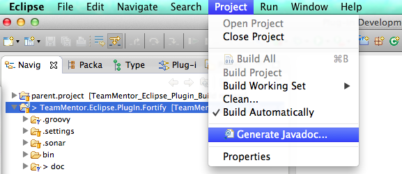
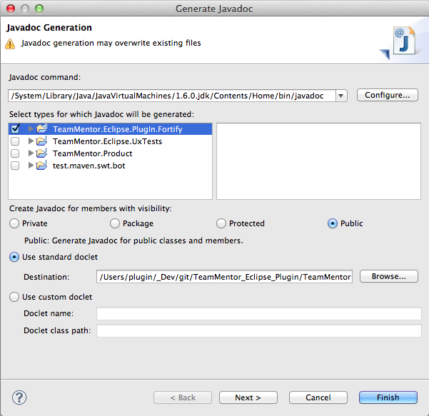
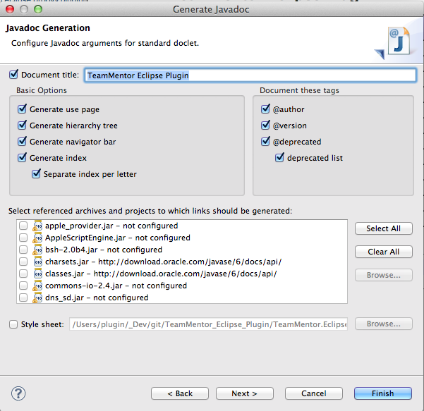
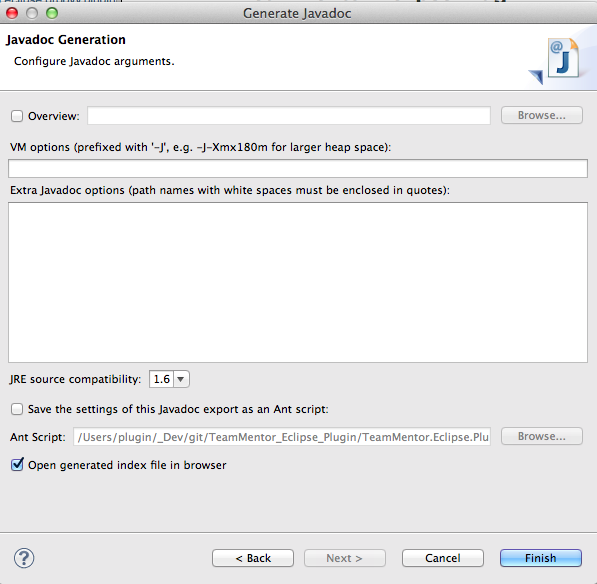
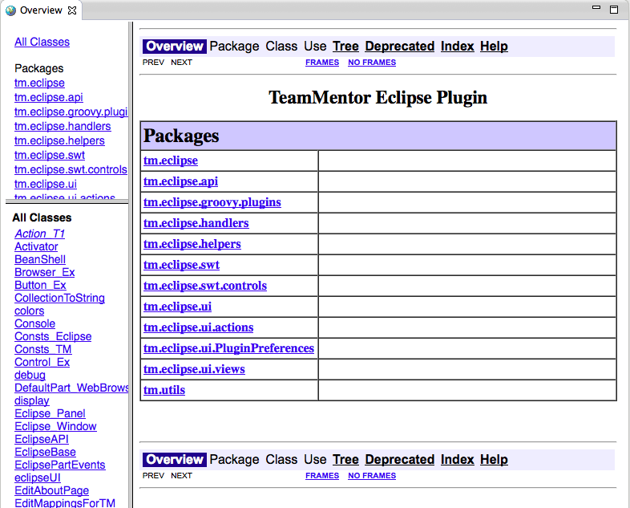
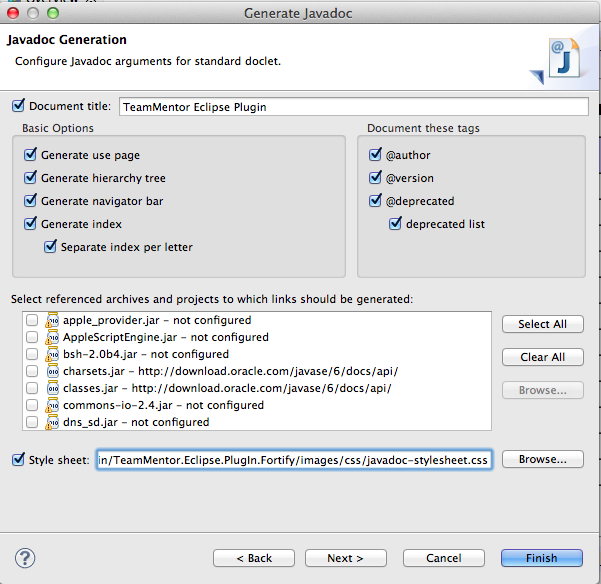
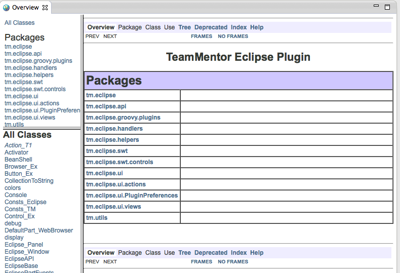
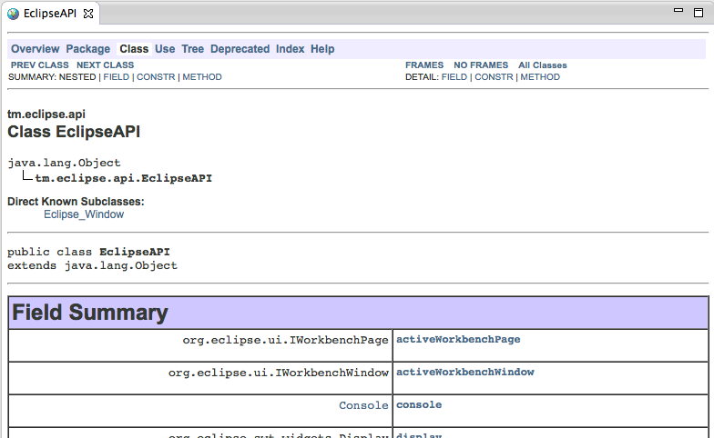
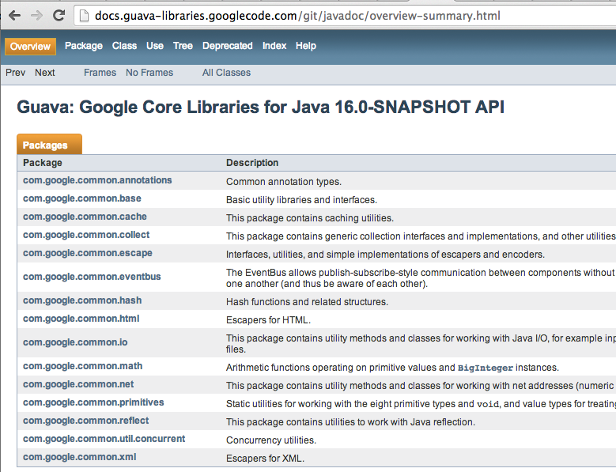
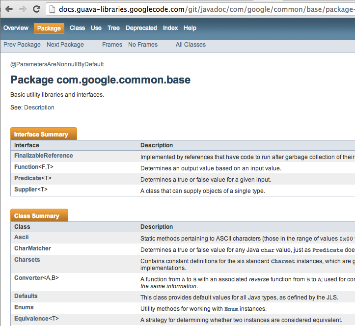

## How to create (using Eclipse) JavaDocs that looks good? (My current approach is not working)

I want to create nice JavaDocs for the API I'm developing for TeamMentor's Eclipse Plugin Builder Kit (see [here](http://blog.diniscruz.com/2013/11/teammentor-plugin-and-builder-v156.html) , [here](http://blog.diniscruz.com/2013/09/two-videos-showing-teammentor-eclipse.html) and [here](http://blog.diniscruz.com/2013/12/executing-eclipse-plugin-junit-tests-in.html)) , but at the moment I'm not having the results I want (see at the end of this post screenshots of the type of JavaDoc I want to create).

Here is the workflow I'm using to create the JavaDocs in Eclipse (Kepler):  
  
1)  Select the menu item **_Project_** + **_Generate Javadoc..._**

  

 2) In the **_Generate JavaDoc_** wizard that pops up, chose the project to create the [JavaDoc](http://en.wikipedia.org/wiki/Javadoc) and click **_Next_**

  

 3) In the next screen, enter a _Document Title , _don't chose a Style Sheet (we will try that later) and click **_Next_**

  

 4) In the final step of the Wizard, click on _Finish _(note that the option to save it as a **_Ant Script_** is really cool, since that way we can automate this process using Ant)

  
5) This is what the created Java doc looks like (which is now what I wanted):

  
6) Next, I tried using a css (which [I got](http://docs.oracle.com/javase/7/docs/technotes/guides/javadoc/whatsnew-7.html) from [here](http://docs.oracle.com/javase/7/docs/api/stylesheet.css)) that I saved on a project's folder and mapped it on this **_Generate JavaDoc_** wizard page:

  
7) And although it looked better:

  
8) It is still not what I wanted:

  
9) Here is an example of the JavaDoc style that I would like to create  

  

  
10) Which looks much better:

  

  

So my question is: **_How do I create JavaDoc that look like the screenshot above?_**  
**_  
_**One thing that might be affecting the current result, is that I'm compiling the Eclipse Plugin using Java 6 (to make it compatible with it), any maybe the desired JavaDoc style is part of the java 7 and I need to use the JavaDoc version that comes with JDK 7 (note that the [stylesheet.css](http://docs.oracle.com/javase/7/docs/api/stylesheet.css) used was from JDK 7) 
