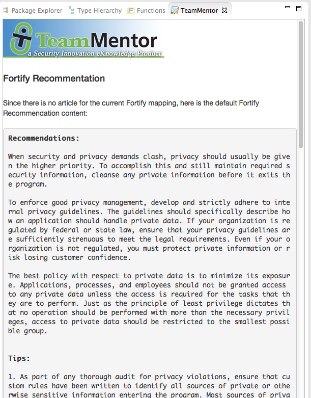
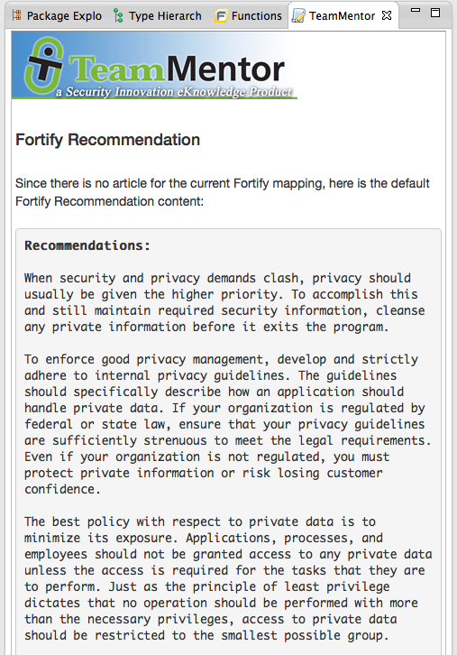
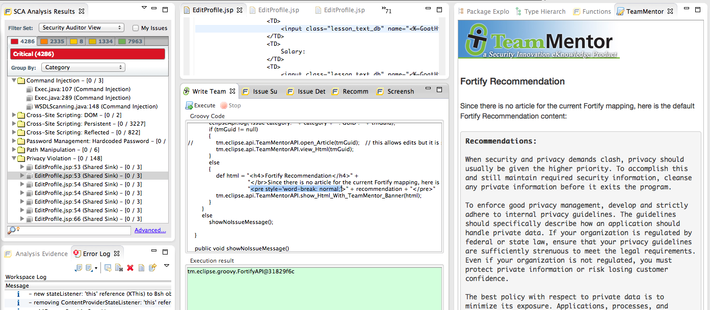
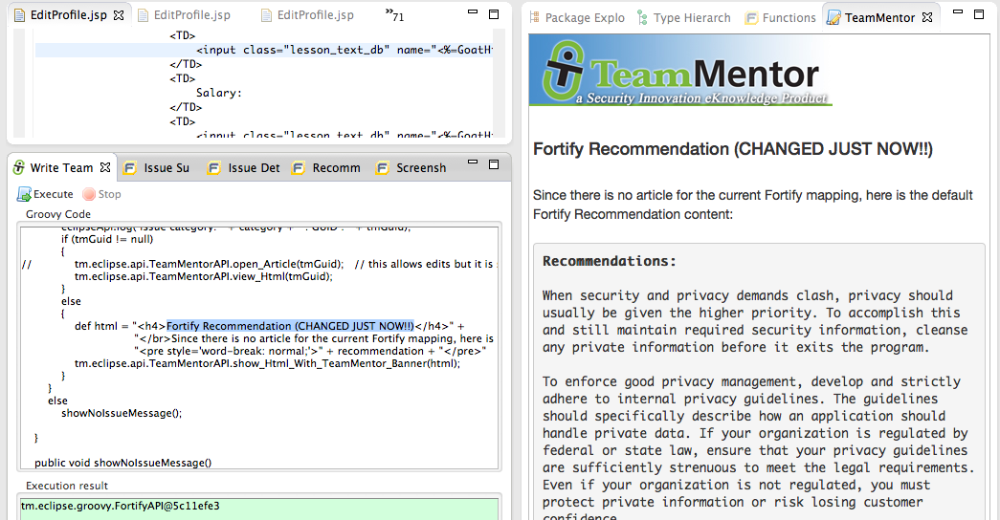

## How to word-wrap a word without breaking it (when using bootstrap)

I just had one of those bugs that should had taken 5m, but ended up taking a lot more because the behaviour of HTML and [bootstrap](http://getbootstrap.com/) was not as easy as I was expected.

Basically the problem was that we needed to handle (in the TeamMentor Eclipse Fortify Plugin) the cases when we don't have a TeamMentor mapping for the issue currently being shown in the Fortify views.

The solution was to show the current Fortify recommendation, which is available from their plugin (I need to explain how I got that data in another post), and after integrating that data in our plugin, it looked like this:  
  

  

The problem is that (if you pay close attention) the word-wrap is actually breaking the words (which is not a good thing)

After much digging into Html, Google and Stack Exchange, I finally found a solution that seems to work ok.

Using the HTML style:  _word-break: normal; _ like this (so that I overwrite the bootstrap defaults):

       "_**<pre style='word-break: normal;'>" + fortifyDescription + "</pre>"**_  
_  
_ With that fix in place, the view now looks like this:

  
Note: You can read all details about this bug here: [https://github.com/TeamMentor/Master/issues/672](https://github.com/TeamMentor/Master/issues/672)

Although it was painful to find the root cause, due the to the [real-time scripting (and development) environment](http://blog.diniscruz.com/2013/08/programming-eclipse-in-real-time-using.html) that I now have in Eclipse I was able to experiment the multiple word-wrap options directly in the 'real eclipse' (the one that also has the Fortify plugin installed).

Here is what that dev/qa environment looked like:

  
With:  

  * The Fortify SCA view on the left (which when clicked should trigger a TeamMentor view on the right)
  * The TeamMentor+Fortify Groovy plugin code in the middle, which is being executed on the current instance (i.e. code changes are immediate)
  * The TeamMentor view on the right which gave me a visual clue that the word-wrapping was working ok (btw, how can we Unit Test this issue? since the prob is only visible to the human eye (or maybe to an OCR-based script?))

To see this action, here is an example where a 'script change', after execution, is immediately shown on the right (without needing Eclipse restart)

  

