## Programming Eclipse in Real-Time (using an 'Groovy based' Eclipse Plug-in)

While working on an Eclipse plugin to integrate [TeamMentor with Fortify](http://blog.diniscruz.com/2013/08/adding-custom-descriptions-and-content.html), it was driving me crazy to have to deal with the loop of:  

  * Write the code in the main Eclipse instance (hosting the Eclipse plug-in project)
  * Start the Eclipse plug-in project (in debug mode)
  * Wait about 1 minute for the 2nd instance of Eclipse to start
  * See the changes
  * Make some fixes

    * If I'm luck they will be in a place that can be done (in the hosting Eclipse instance) without a restart of the 2nd eclipse
    * If I'm not lucky, go back to step one

This approach has a number of problems  

  * Eclipse is quite an heavy and memory hungry application
  * The changes are not done in a REPL mode (i.e. interactive with immediate feedback to the execution result)
  * It is very hard to try existing Eclipse APIs and '_see what they do and how they work_' (very important when learning a new API)
  * The Java APIs (just like the C# ones) are very verbose, ugly and hard to use (specially when compared with the type of coding I am now used to with [FluentSharp](http://www.nuget.org/packages?q=fluentsharp) APIs)

What I really wanted was the same environment that I created for .NET, where I was able to [Program VisualStudio in real-time using C# REPL](http://blog.diniscruz.com/2012/10/programming-visualstudio-in-real-time.html)   

I.e. **I want to program Eclipse in real-time** (i.e. the executed plug-in code must have access to the 'current' Eclipse application (i.e. its host)). This capability will be critical for one of my next stages of development, which will be based on having access to the artefacts currently available/exposed on other plug-ins (from java AST to other tool's results)

I also wanted to move away from pure Java code and use something like the [O2 Platform REPL Enviroment](http://blog.diniscruz.com/p/c-repl-script-environment.html).

One option was to use Jni4Net (see [Using Jni4Net (Part 3) - Writing and Invoking O2 Methods from Java and Eclipse](http://blog.diniscruz.com/2012/11/using-jni4net-part-3-writing-and.html)), but after doing a bit of research I found [Groovy](http://groovy.codehaus.org/) which seemed like the perfect way to write Java code (and it is also very similar in philosophy to FluentSharp's extensionMethods and capabilities).

As I [tweeted](https://twitter.com/DinisCruz/status/370229276714729472) [at time](https://twitter.com/DinisCruz/status/370229876479254528), I was able to pull it off :)

Here is a Groovy script that changes the title of the current Eclipse application:

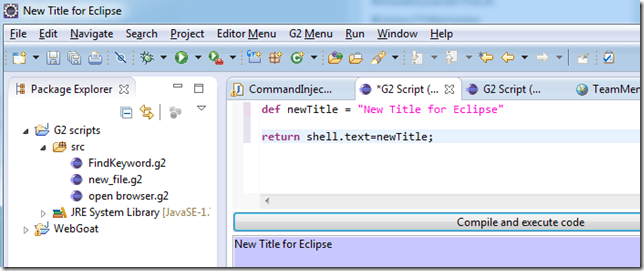

Here is a script that opens a WebBrowser in a particular Url:

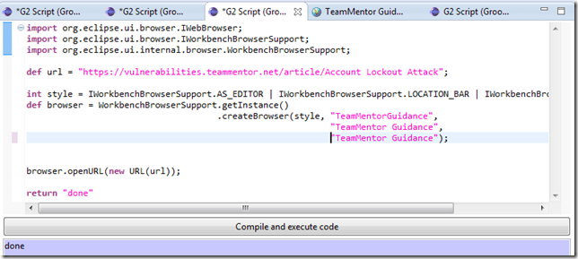

Here is a (very rough/poc) script that dynamically adds a number of buttons to an existing SashForm:

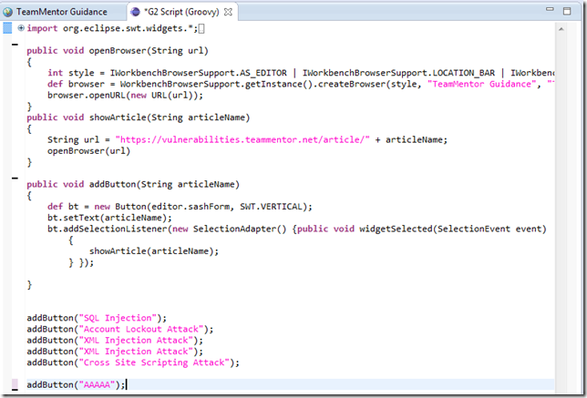

... the code shown above, when executed, looks will do this (note the extra buttons):

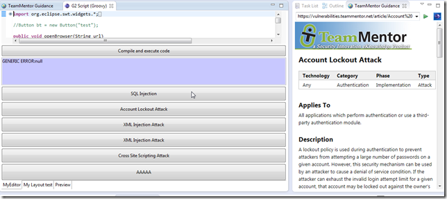

**How it works**  

As with the O2 .NET VisualStudio extension, my objective was to create the smallest possible Eclipse Plug-in that only did one thing: expose an REPL Script environment.

The idea is that once there is a REPL environment, the rest can be programmed+compiled+executed dynamically (i.e. only the original plug-in code would be written in Java, and have a hard dependency on eclipse (i.e. a place where changes require a restart (and making a cup of tea)).

What follows is the description of the multiple files and techniques used to achieve the REPL environment  shown above.

The eclipse plug-in created was based on the MultiPartPageEditor sample.

Here is the current project structure:

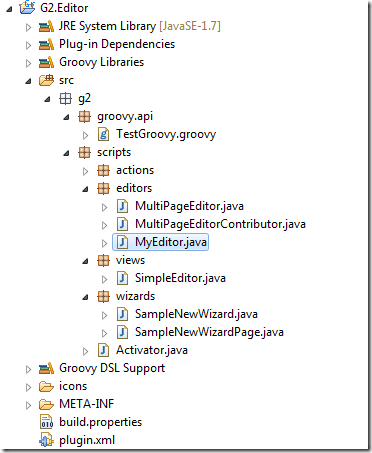

The**_ plugins.xml_** file defines an: editor, view, wizard:

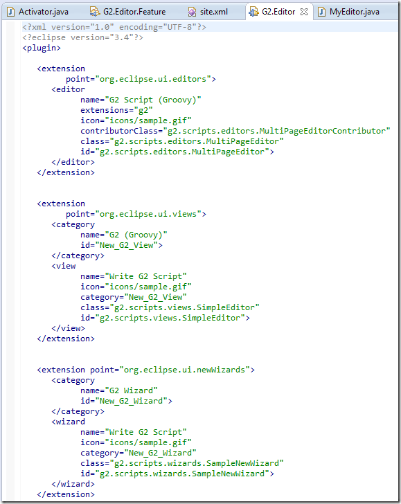

... and menu:

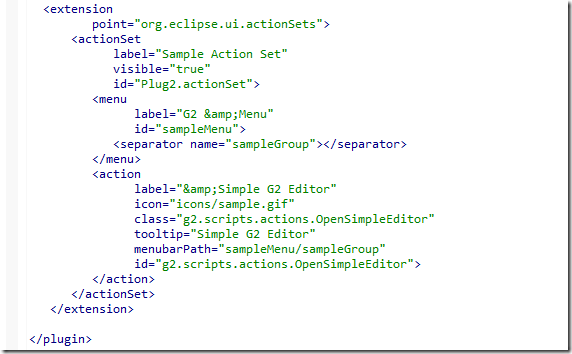

The MANIFEST.MF files looks like this

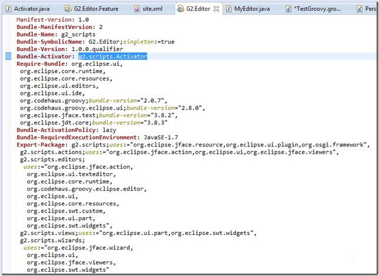

In an Eclipse plugin (as far as I can tell), the execution starts with the class defined in the **Bundle-Activator** setting (highlighted above).

In this case that is the **_g2.scripts.Activator_**, which looks like this:

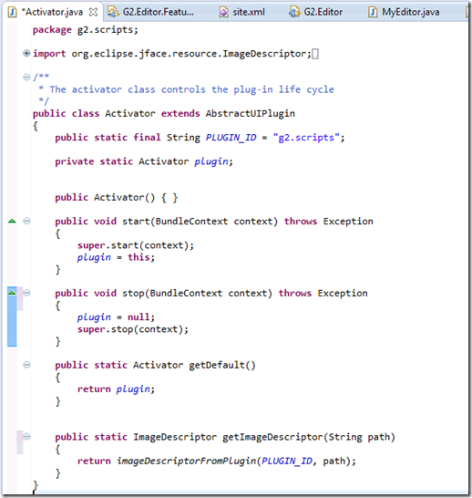

Note that this file doesn't do nothing fancy.

In this first version of the plugin, I reused the auto created (from the sample code) Wizard:

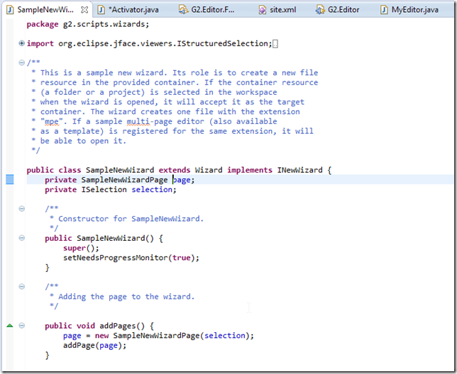

... with only a small change made on the default editor _**contents:**_  

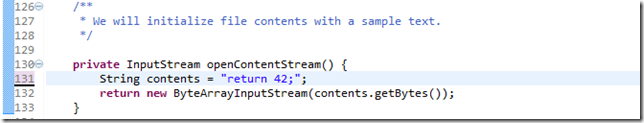

The **_SampleNewWizardPage.java,_** is also just about the same as the original version, with only a small change on the file extension.

Here:

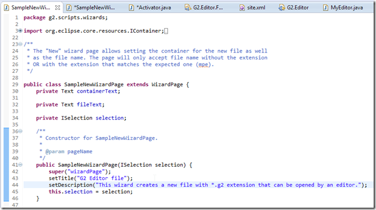

... here:

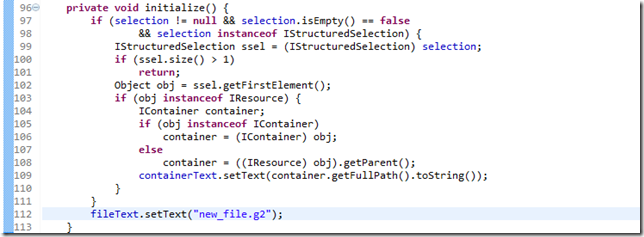

... and here:

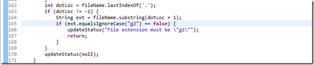

To see this wizard in action, start the plug-in, and (after waiting for the new Eclipse instance to start), and select **File --> New -- > Other**:

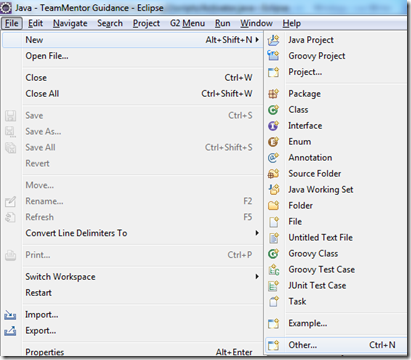

... on the G2 Wizard category, select the _Write G2 Script_ option and click next

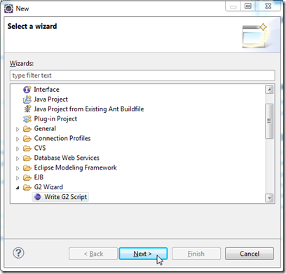

In the next chose a container (i.e. where the new file will be created)

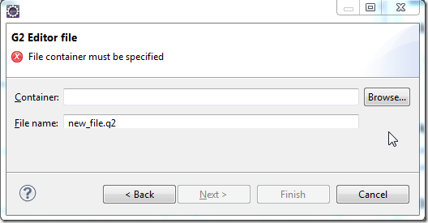

... click finish:

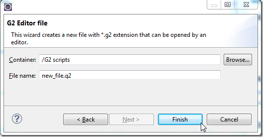

... and we will have an REPL environment that looks like this:

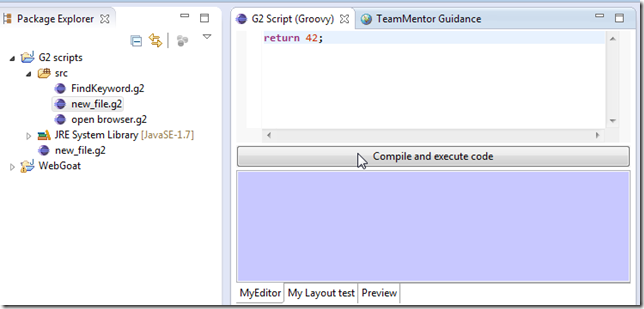

*Running Groovy scripts (REPL Style)**  

In the environment shown above, if we click on the **_Compile and execute_** code button, we will see the execution result in the purple panel (which in this case is the global answer to everything: 42)

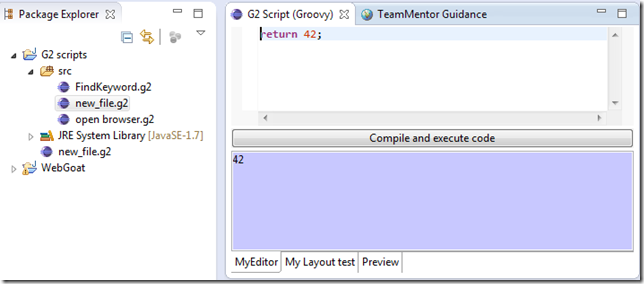

Since this is a Groovy environment, we can write and execute any valid Goovy commands. For example:

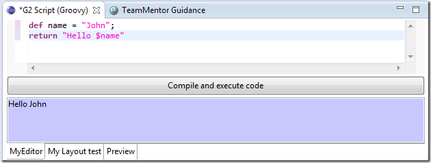

... same output using Goovy's equivalent of C# Lamda methods:

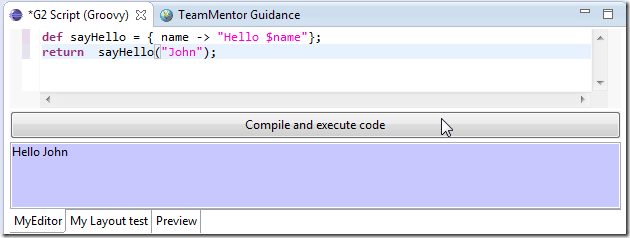

Here is a simple script to get all methods available in the String class:

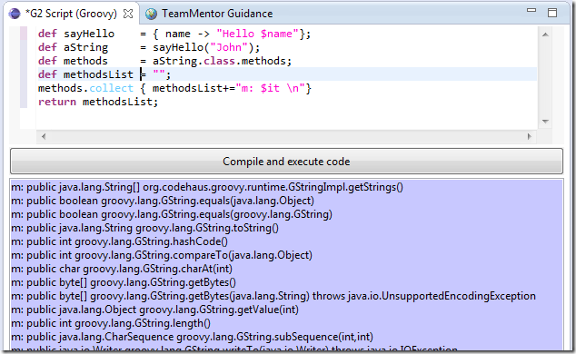

.. similar output in one line of code (isn't Groovy great?):

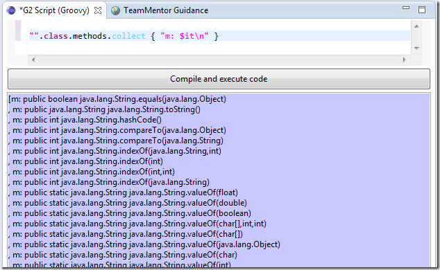

**OK, so what is happening under the scenes?**  

In the 2nd Eclipse, when a \*.g2 file is opened, an instance of the **_MultiPageEditor_** will be created.

Back into the original/host Eclipse, the main changes on the **_MultiPageEditor.class_** file are the use of the MyEditor class:

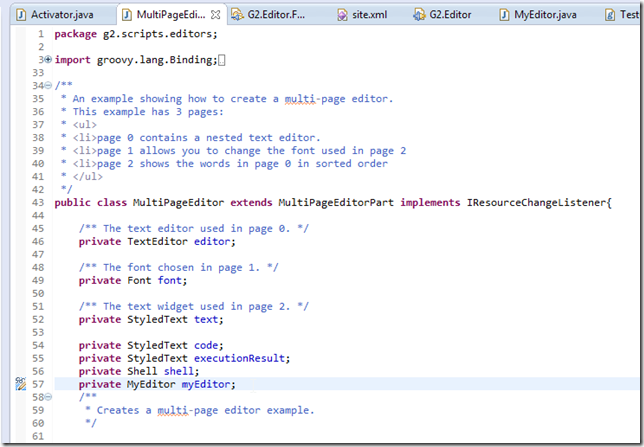

... on the page0 (first tab):

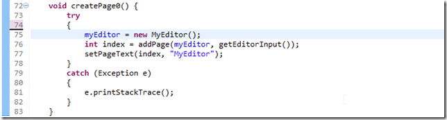

It is on the MyEditor class that all the Goovy REPL functionality was implemented:

The MyEditor class extends the GroovyEditor with a number of extra variables that will be made available to the Groovy script:

The G2 editor GUI is created on **_createPartControl_** method which will:  

  * Create a **_SashForm_** and assign it to the provided **_parent_**
  * Add a Button with a callback to **_compileAndExecuteCode_** method
  * Add a StyledText and make it purple (this will be used to show the execution result)
  * Set a number of variables (based on the currently available objects)

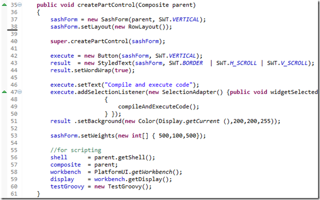

The **_compileAndExecuteCode_** method is used to execute the **_compileAndExecuteCode_InGuiThread_** in the current UI thread (so that any uses of UI objects don't throw 'thread access exceptions'):

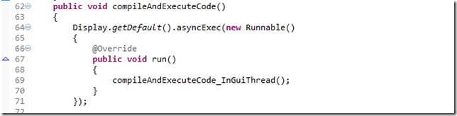

The **_compileAndExecuteCode_InGuiThread_**  will:  

  * Get the current text from the TextEditor
  * Create a Binding object and assign a number of very interesting/powerful objects to it:

    * **shell**: the actual main Eclipse UI shell object (for example its **_text_** field is the title of Eclipse)
    * **composite**: main/host panel for the current Editor
    * **editor: **the current editor object
    * **workbench: **Eclipse Workbench object (same as calling **_PlatformUI.getWorkbench()_** from code)
    * **Display**: the UI Display objet
    * **testGroovy**: an Goovy class (more details bellow

  * Create a GroovyShell object that uses the current plug-in ClassLoader (which means that we will have access (from the groovy scripts) to all the currently loaded plug-in jars/classes)
  * Execute/eval the text we got from the TextEditor
  * Set the output panel with the result (or any compilation/execution errors)

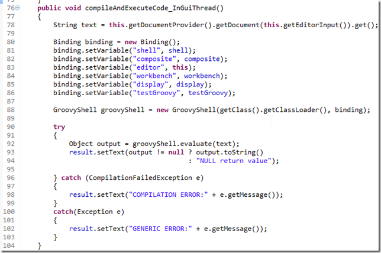

In practice this setup means that we can write scripts using the objects set in the Binding object, for example the shell object:

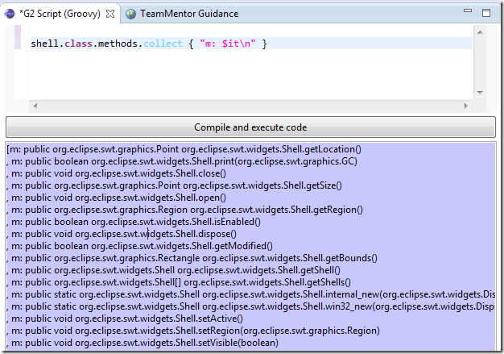

Another really cool feature/capability, is that it is also possible to have a native groovy class:

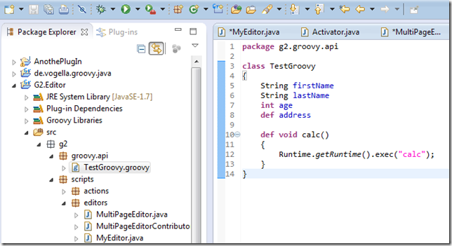

... created from Java:

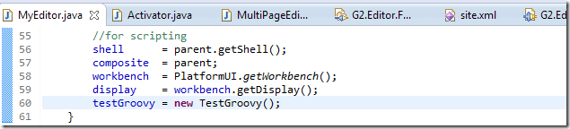

... added to the Groovy's Binding object:

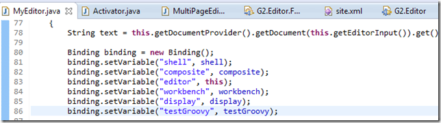

... and accessed by the real-time Groovy execution environment:

Here are the default values of the **_TestGroovy_** class:

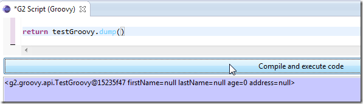

... which can be changed and viewed like this:

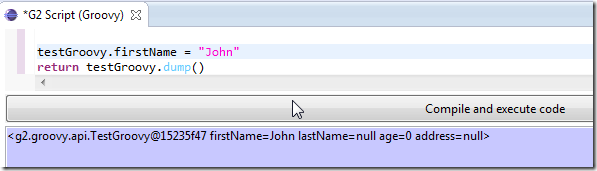

This last part is REALLY interesting/powerful, since it means that we can develop an groovy based API in real-time (2nd Eclipse instance), which is then added to the host eclipse instance (i.e. the plugin-code)

Btw: I'm pretty sure there are easier ways to do this, and it would be great if I could get some help with the next versions (for example I had probs using the GroovyEditor outside an Eclipse Editor/Page environment and I was not sure how to enable CodeComplete/Intelisense to the GooryEditor)

**Deployment**  

To deploy this I created an Feature and UpdateSite project (which once the plug-in is a bit more mature, I will find a location to host it in a public environment)

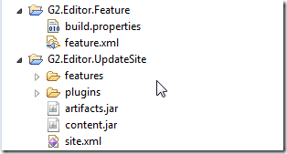

This is just the beginning....

Eclipse coding here we go....
