## XStream "Remote Code Execution" exploit on code from "Standard way to serialize and deserialize Objects with XStream" article

At the DefCon 2013 I co-presented (with [Abraham](http://www.linkedin.com/pub/abraham-kang/0/953/384) and [Alvaro](https://twitter.com/pwntester)) the ["RESTing On Your Laurels will Get YOu Pwned"](http://blog.diniscruz.com/2013/08/slides-for-defcon-presentation-on.html), which showed a number of PoCs on how REST interfaces and APIs can create a number a security vulnerabilities:

Since that time, I have blogged about a couple of the demos created:  

  * **XmlDecoder JDK class: **[Using XMLDecoder to execute server-side Java Code on an Restlet application (i.e. Remote Command Execution](http://blog.diniscruz.com/2013/08/using-xmldecoder-to-execute-server-side.html))
  * **Groovy on Admin Interfaces: **[Neo4J CSRF payload to start processes (calc and nc) on the server](http://blog.diniscruz.com/2013/08/neo4j-csrf-payload-to-start-processes.html) 

We also showed a PoC using the **_[XStream](http://xstream.codehaus.org/)_** API (which had been [reported to the XStream developers](https://www.mail-archive.com/user@xstream.codehaus.org/msg00604.html)) which so far has not made it into a blog post (the PoCs presented at DecCon are [here](https://github.com/o2platform/DefCon_RESTing/tree/master/Demos/_O2_Scripts/Spring-XStream) and [here](https://github.com/o2platform/DefCon_RESTing/tree/master/Demos/_O2_Scripts/Spring-XStream/exploits)).

Since a quick search for '**_XStream Vulnerabilities_**' only shows a couple examples ([Spring Source OXM Remote OS Command Injection when XStream and IBM JRE are used](http://securityvulns.com/docs26618.html), [JAVA RESTful Services | Fuzzing Down the Rabbit Hole: Part One](http://rotlogix.com/blog/?p=114)  and [this git commit](https://github.com/spring-projects/spring-framework/pull/322/files)), I think it is fair to say that this is issue is still quite unknown.

A good example of how the dangers of **_XStream_** are not fully understood is the [Standard way to serialize and deserialize Objects with XStream](http://blog.sodhanalibrary.com/2013/12/standard-way-to-serialize-and.html):

  

  

This blog post shows a _"...standard way of using XStream in profeessional projects to generate XML or JSON or Objects..." _which unfortunately will make any application that uses that API vulnerable to (amongst other things) remote code execution.

  

As soon as I saw that article, I thought _"humm... this looks vulnerable to the XStream code execution vuln we showed at DefCon" _and since it was a slow Saturday here in London, I had a bit of time to create a PoC to confirm my assumption :)

  

After replicating the _XMLGenerator _API proposed on the [Standard way to serialize and deserialize Objects with XStream](http://blog.sodhanalibrary.com/2013/12/standard-way-to-serialize-and.html) article (see full workflow I took below), I was able to pop a Calculator on my OSx test box using this script ([gist here](https://gist.github.com/DinisCruz/8077118#file-1-poping-a-calculator-on-osx-using-xmlgenerator-xstream-based-api-java)):

  

  
... which when executed,  first opened the **/Application/Calculator.app **and then failed (the _XMLGeneration/Stream _step) with this **_cast_** exception:

  

Note: we can also use this OSx **_open_** command to:

  

... open the current folder (with an argument of **"."**)

  

  

 ... open a particular webpage (with an argument of **_"https://www.owasp.org"_**):

  

  

**  
**

**Bottom Line: Be very careful when using XStream**

**  
**

In addition to this remote command execution PoC, [XStream](http://xstream.codehaus.org/) allows the creation of server side objects based on reflection (which means that you could have all sorts of business-logic sensitive objects being created). 

  

Note: As the XStreamMarshaller quote shown at the end of this post shows, It looks like there is an official way to limit which objects XStream will create, but I'm not sure on the best practices (please comment below if you know more about how to '_securely use XStream_')

**  
**

**  
**

**So how is this possible?**

**  
**

Basically (the way I see it), XStream is an _'__reflection-_**_based_** _XML-to-Object conversion'_.

Where XStream takes the XML provided and tries to create Java objects based on it.

  

Here is an example of the [XStream Serializing and Deserializing capabilities in action](http://xstream.codehaus.org/tutorial.html#to-xml):

  

[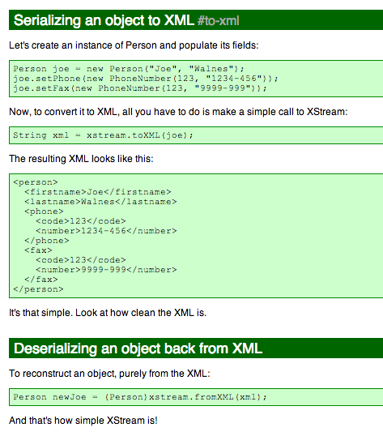](http://1.bp.blogspot.com/--XV55ajaav8/UrY53k9vgrI/AAAAAAAAFQo/U6SJIptLR1c/s1600/Screen+Shot+2013-12-22+at+00.59.42.png)

Basically XStream is able to take an XML that represents and object and make it into an nice POJO (which is a great feature and I can see why developers really like it).

  

The objective of the [article in question](http://blog.sodhanalibrary.com/2013/12/standard-way-to-serialize-and.html) is to create an API that makes this even simpler:

  

[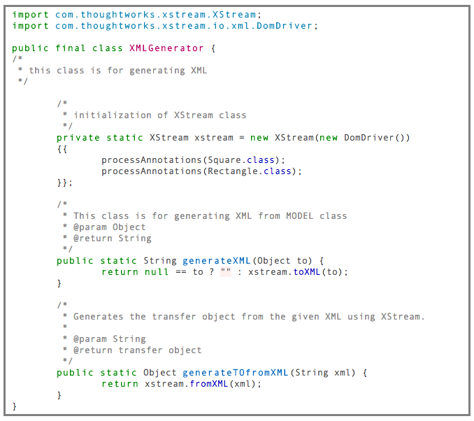](http://2.bp.blogspot.com/-Z1ctj_xujD0/UrY6sG0hK2I/AAAAAAAAFQw/Mmbhami7dPQ/s1600/Screen+Shot+2013-12-22+at+01.03.21.png)

  

... which can then be used like this:

  

[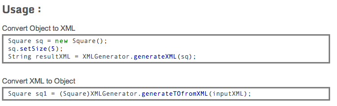](http://1.bp.blogspot.com/-sAPgwS44Vl8/UrY6sEzVuWI/AAAAAAAAFQ0/-Royai8TNwE/s1600/Screen+Shot+2013-12-22+at+01.03.29.png)

  

**To see this in ****see this in action, ****let's fire up an new Eclipse project and follow these 23 steps:**

  

1) create a new Java Project

  

  
2) call it (for example) **_XStreamPoC_**

  

 3) Add a folder called **_lib_**

[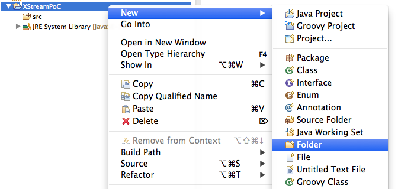](http://3.bp.blogspot.com/-FJud-9lRTxM/UrZGZRabwcI/AAAAAAAAFRI/u_GFSEF7qSE/s1600/Screen+Shot+2013-12-22+at+01.07.02.png)

  
4) Copy to that folder the **xstream-1.4.6.jar **file that can be downloaded [from here](http://xstream.codehaus.org/download.html):

  

5) Add the **xstream-1.4.6.jar **jar to the **_Build Path_** of the current project

  

[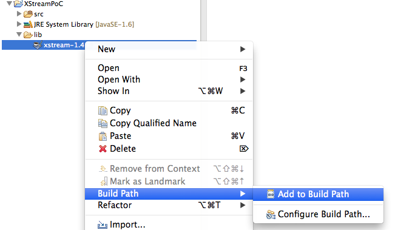](http://3.bp.blogspot.com/-uAJcHns0sPk/UrZGa6dXBqI/AAAAAAAAFRs/7wzLJ6lekfA/s1600/Screen+Shot+2013-12-22+at+01.09.03.png)

  
6) In your browser, open the [Standard way to serialize and deserialize Objects with XStream](http://blog.sodhanalibrary.com/2013/12/standard-way-to-serialize-and.html) page, copy the contents of the **_XMLGenerator.java _**file (in the middle of the page), (back in Eclipse) select the **_src_** folder and select (or type) **_Paste_**  
**_  
_**  

[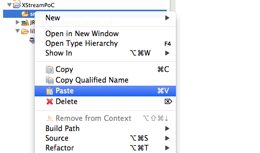](http://3.bp.blogspot.com/-6J7bB7tksLY/UrZGaA-7MsI/AAAAAAAAFRk/rE1drcdL5SM/s1600/Screen+Shot+2013-12-22+at+01.08.16.png)

  
7) Note how that _Paste _created a new **_Java_** file with the contents of the clipboard (which is a pretty cool Eclipse feature :) )

  
8) Go back to the [Standard way to serialize and deserialize Objects with XStream](http://blog.sodhanalibrary.com/2013/12/standard-way-to-serialize-and.html) page, and do the same thing for the **_Square.java_** and _Rectangle.java_ files

[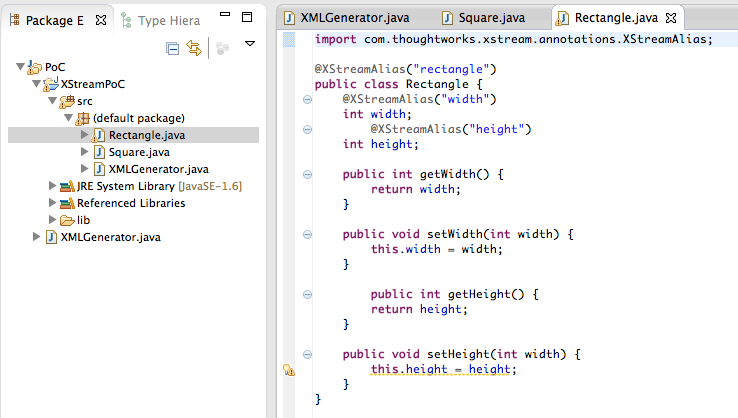](http://4.bp.blogspot.com/-EnAAEYAusww/UrZGbnMUkdI/AAAAAAAAFSE/9SHPzG4r0gU/s1600/Screen+Shot+2013-12-22+at+01.10.33.png)

Note: at this stage there should be no compilation errors in the current Eclipse project

9) Next add a new class

[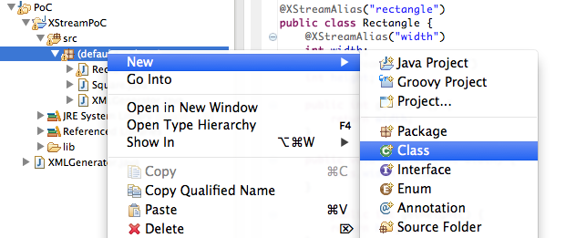](http://3.bp.blogspot.com/-zYxo0nKRTAQ/UrZGb_7YI7I/AAAAAAAAFR8/YJmR1Ft1qJ4/s1600/Screen+Shot+2013-12-22+at+01.10.50.png)

  
10) ... called XStreamPoC (note tick the _public static void main(String[] args) _checkbox before clicking on **_Finish_**)

[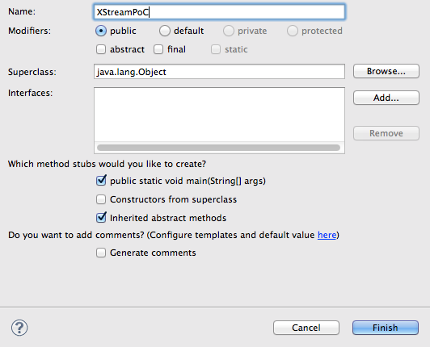](http://1.bp.blogspot.com/-EU84fAQWEEg/UrZGexhb8gI/AAAAAAAAFTE/kDCxm8VZ-Pk/s1600/Screen+Shot+2013-12-22+at+01.11.11.png)

  
11) on the Main method add a simple test _System.out.Println _command and run the project as a **_Java Application_**

[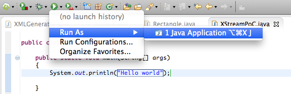](http://3.bp.blogspot.com/-weznNQum-vE/UrZGclZoE8I/AAAAAAAAFSM/3u3XGw2-dmM/s1600/Screen+Shot+2013-12-22+at+01.11.53.png)

  
12) Which should look like this:

[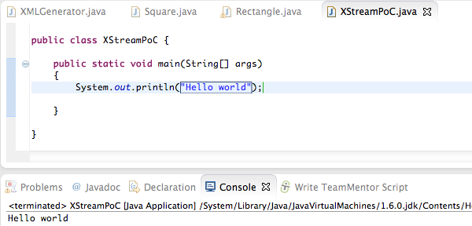](http://2.bp.blogspot.com/-Rrg3T-55gbc/UrZGdGuJcqI/AAAAAAAAFSc/jY6AZQLC6sU/s1600/Screen+Shot+2013-12-22+at+01.12.02.png)

13) Now it is time to use the XmlGenerator usage samples from the  [Standard way to serialize and deserialize Objects with XStream](http://blog.sodhanalibrary.com/2013/12/standard-way-to-serialize-and.html) page:

  
14) Which when executed should look like this

[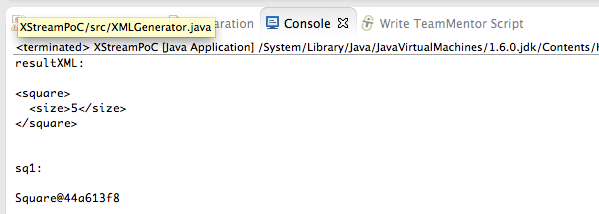](http://2.bp.blogspot.com/-BbbitNgk9nw/UrZGdzFbxAI/AAAAAAAAFSk/IaQnObkgg5k/s1600/Screen+Shot+2013-12-22+at+01.15.06.png)

  
Note: in the image above we can see the type of 'clean' XML that XStream expects to consume.

15) Next lets remove the serialisation part and just look at the process of converting XML strings into Objects.

In the image below you can see both cases (using the _**XmlGenerator.generatorToFromXML**_ and the respective **_XStream_** code)

  

[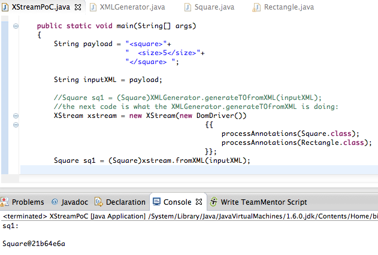](http://3.bp.blogspot.com/-cuYNiJExdzM/UrZGeXt1WJI/AAAAAAAAFS0/YHPox9we0dw/s1600/Screen+Shot+2013-12-22+at+01.18.47.png)

  
16) What is interesting/dangerous about the XStream API, is that it will create the object as defined in the XML file. Note how in the example below, the Java _string _is created first, and then attempted to be casted into the **_Square_** class

[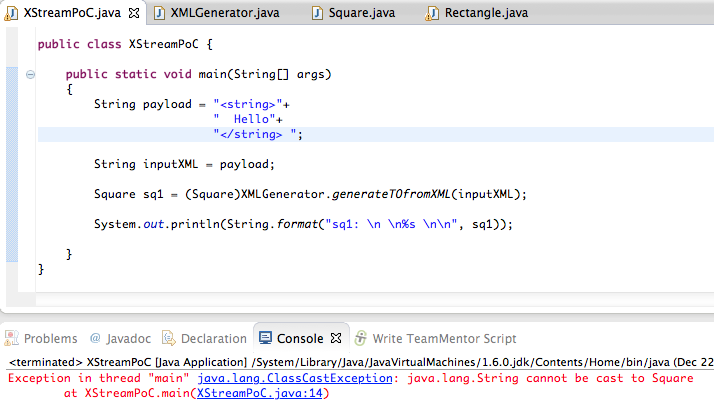](http://4.bp.blogspot.com/-2VEu7skoffY/UrZGg55g_rI/AAAAAAAAFTs/vAUM3Lo8_Zk/s1600/Screen+Shot+2013-12-22+at+01.19.37.png)

17) we can confirm that the Java string is indeed being created ok, if we remove the case to _Square _and treat the **_sq1_** variable as a Object

  

18) Here we create a **_Java_** **_string_** based on its full signature:

[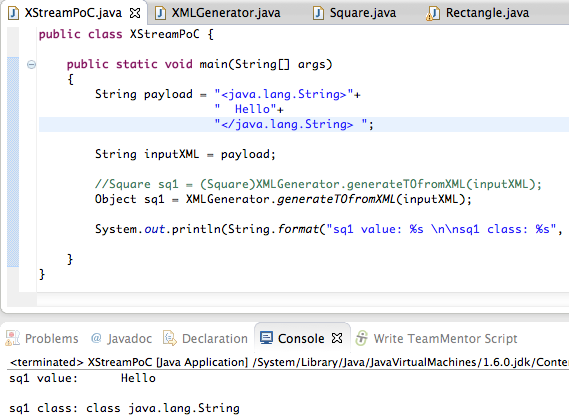](http://2.bp.blogspot.com/-t5Qm_ropjhM/UrZGfmy0_PI/AAAAAAAAFTM/PON3faEe4i4/s1600/Screen+Shot+2013-12-22+at+01.25.57.png)

  
19) Which means that we can create any object that is currently loaded in the class path (and we can create the required objects to invoke its constructor).

The next example shows how to create an instance of the **_InitializationException_** class:

[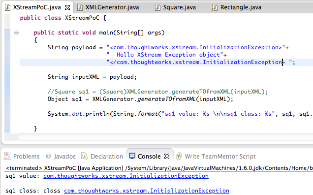](http://3.bp.blogspot.com/-D1LbuQtuiXU/UrZGfwr80VI/AAAAAAAAFTU/FPLkrq1PlzM/s1600/Screen+Shot+2013-12-22+at+01.30.20.png)

20) And this one how to create a**_ java.lang.ProcessBuilder _**object

  
21) Note that the cast error (using the original code) will occur after the **_ProcessBuilder_** object is created

  
22) At the moment we still have a problem that we are only creating objects, not invoking them. That is where the [dynamic-proxy](http://xstream.codehaus.org/javadoc/com/thoughtworks/xstream/converters/extended/DynamicProxyConverter.html) + EventHandle technique comes into play.

First lets see how to invoke a method (in this case the **_start_** from the **_ProcessBuilder_** object) using a variation of a [code sample from Alvaro's thread with the XStream developers](https://www.mail-archive.com/user@xstream.codehaus.org/msg00605.html):

Note: The cast exception happens when the **_TreeSet _****Comparable **invokes the _EventHandler _(which returns the execution result of the **_start_** method)

23) the final step is to convert the TreeSort code shown above into XML seen below (I used the _XMLGenerator.generateXML _to help in the creation of the final payload (which is a variation of the payload we showed at DefCon)):

  

  

  

Note: [here are XML examples](http://xstream.codehaus.org/converters.html) of the inputs supported by the multiple XStream converters

  

**  
****Conclusion: Be very careful when using XStream and don't feed it XML retrieved from untrusted sources**

**  
**

Hopefully this post shows how dangerous it is to create APIs like the **_XMLGenerator_** one. 

  

What [Srinivas Dasari](https://twitter.com/SodhanaLibrary) article also [shows](http://blog.sodhanalibrary.com/2013/12/standard-way-to-serialize-and.html), is that unless these type of dangers are clearly mapped,  identified exposed and visualised, it is just about impossible for developers (like [Srinivas](https://twitter.com/SodhanaLibrary)) to understand the dangers of the APIs they are are consuming. 

**  
**

  
**Appendix A) Source code**

All code samples shown in this post [are on this gist](https://gist.github.com/DinisCruz/8077118)

  

**Appendix B) XStream in the Spring Framwork.**

**  
**

The original PoC Alvaro created for XStream used the Spring Framework [XStreamMarshaller](http://docs.spring.io/spring-ws/sites/1.5/apidocs/org/springframework/oxm/xstream/XStreamMarshaller.html) which provides this guidance [at the end of this doc](http://docs.spring.io/spring/docs/3.0.x/reference/oxm.html):

  

[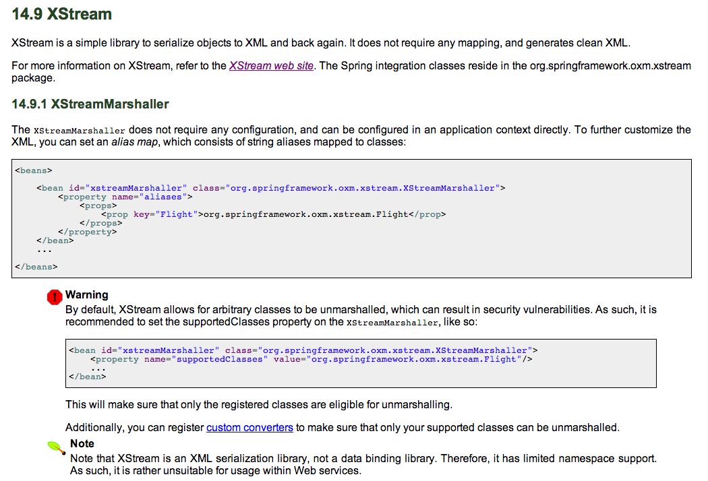](http://4.bp.blogspot.com/-D__eQhI_cxw/UrY4xsrri9I/AAAAAAAAFQg/p53OQwhLcbc/s1600/Screen+Shot+2013-12-22+at+00.55.41.png)

  

  

